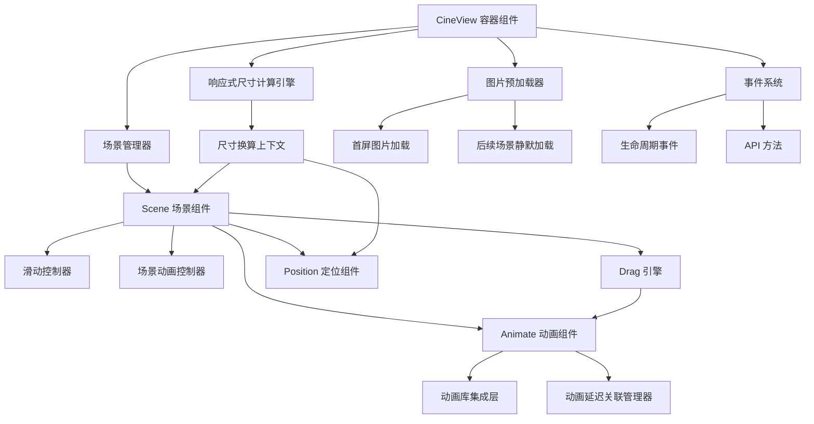
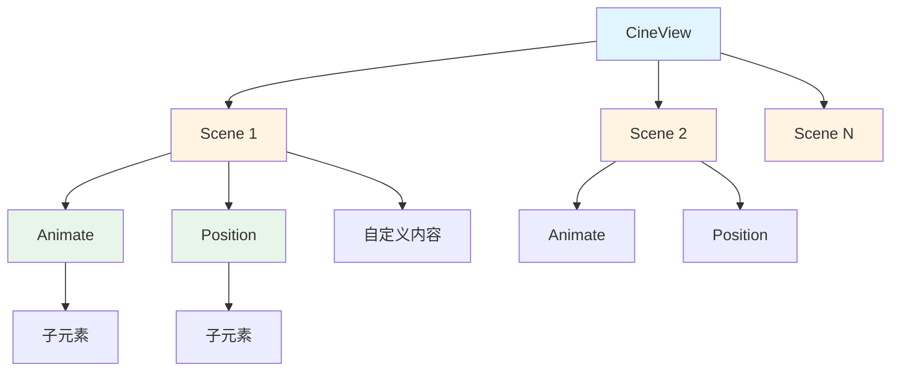
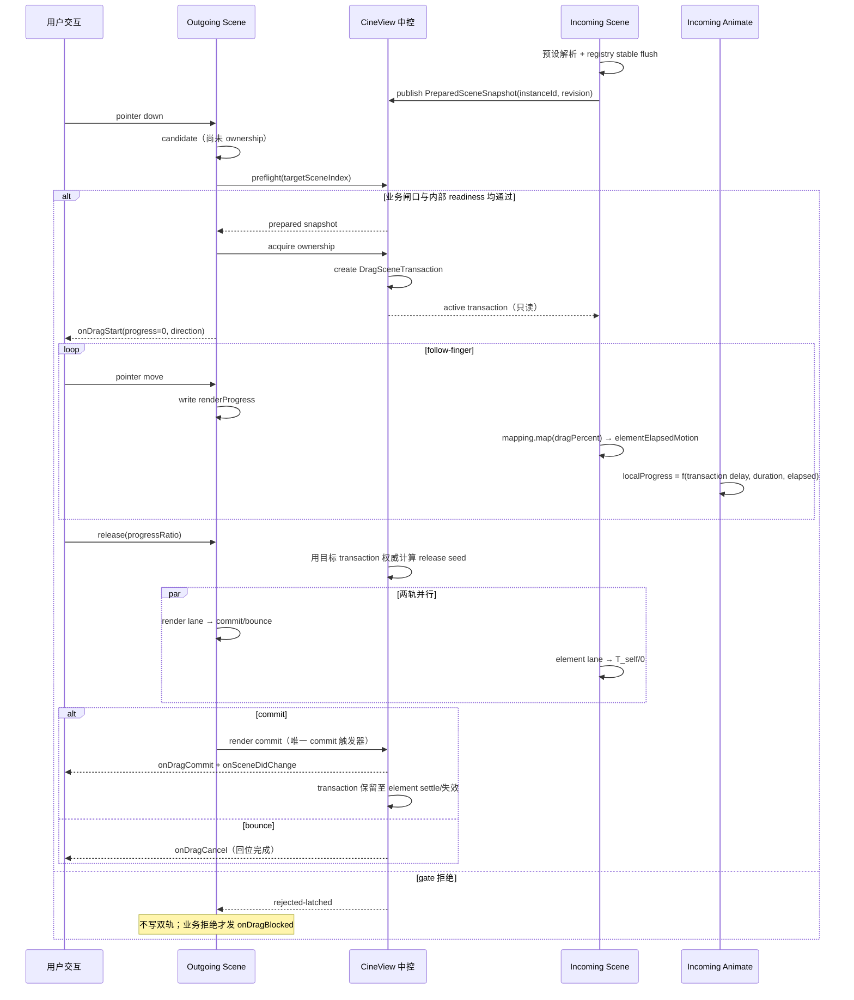
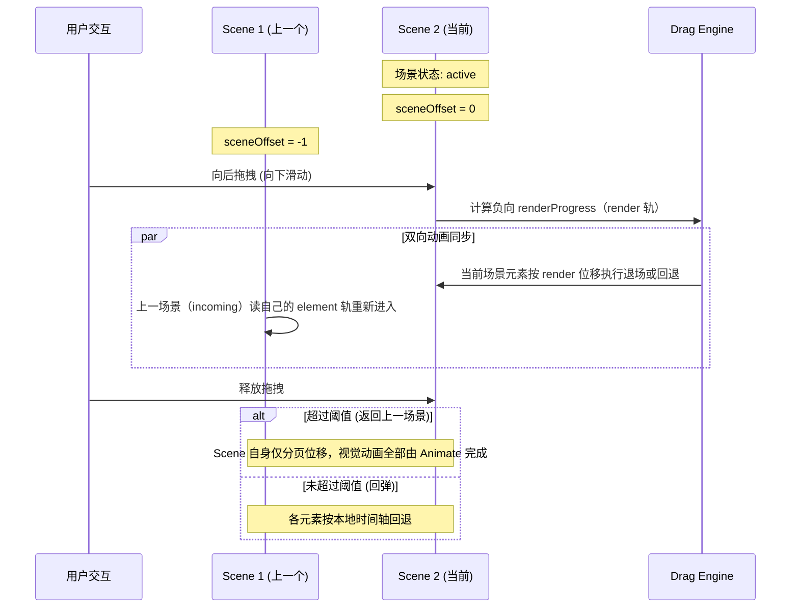

# 设计文档：CineView React UI 框架

## 概述

CineView 是一款专为 React 开发的 UI 框架，用于创建影院式分页体验与滚动驱动叙事页面。该框架提供完整的场景管理、动画系统、响应式布局和图片预加载能力，支持移动端和 PC 端跨平台使用。通过声明式组件 API，开发者可以构建全屏分页页面、真实文档流叙事页面，以及两者结合的产品展示和交互式故事页面。

核心特性包括：分页切换系统（支持横向/纵向）、滚动驱动动画、场景进入/离开动画、响应式尺寸自动换算、灵活的定位系统、动画延迟关联机制、图片预加载和丰富的事件/API 接口。

## 当前架构裁决

基于当前 `drag / scroll` 两模式重构需求，CineView 的后续开发统一采用以下架构裁决：

1. `drag`、`scroll` 是两套不同引擎，由 `CineView` 根节点统一声明模式，不再把模式挂在 `Scene` 上。
2. `Scene` 的职责统一为章节级能力容器、布局边界、可视信息与 scene-owned layer 宿主，不负责决定根交互模式。
3. `drag` 模式下：
   - `Scene` 负责分页位移、边界、candidate/ownership/release/rollback/commit，并通过 `Scene.drag` 声明目标资格和本 Scene 的元素时间轴映射
   - `Animate` 负责元素级视觉动画；`timeline.sceneControlled=true`（默认）领取 Scene element 轨，`false` 则在 Scene 正式到场后按自身真实时间播放
   - 主时间语义为全局 render 轨 `renderProgress` + 每个 Scene 自持单写者 element 轨 `elementElapsedMotion`
   - CineView 持有稳定 `PreparedSceneSnapshot` 目录与跨 commit 的不可变 `DragSceneTransaction`；outgoing 只提交目标索引与释放比例，incoming 与公共 commit detail读取同一 transaction
   - 旧 `dragTimeScale`、页面时长抬高元素 `T_self`、live registry 驱动当前事务、以及单一全局 `sharedElapsedMs` 交接模型均已废弃
4. `scroll` 模式下：
   - 页面首先是正常文档流，`Scene` 允许小于 `100vh`
   - 滚动输入 ownership 固定为 `一个 Scene.scroll progress owner 或 native document flow`，二者不能并行或拆分消费同一段输入
   - completed scene 的反向倒放不是独立重放模式，而是同一个 scene progress 从保留的 `100%` 向 `0%` 回退
   - `timeline.sceneControlled=true`（默认）的动画位于 `Scene.scroll` 内时必须依附该局部滚动接管区，不能各自按元素 viewport 位置单独抢控制权
   - 普通文档内容默认持续参与自然文档流，不允许被“进入 viewport 才显示”的门控规则接管
   - `timeline.sceneControlled=false` 的动画，或不在 takeover zone 内的默认动画，才允许按可视规则自动执行；这种可视规则只负责补充动画，不负责决定正文内容是否可见
   - `Position.fixed` 在 scroll 下是 scene-scoped fixed layer，不允许跨 scene 漂浮
   - root 只保留真实滚动容器，不再用虚拟滚动轨道重写页面空间
5. `renderProgress` 只用于 drag 场景位移，不作为 scroll 的主语义。
6. 每个元素必须根据所属模式消费对应时间语义，禁止跨模式复用解释。
7. 已完成入场的元素，如果配置了 `infiniteAnimation`，只有在运行态允许时才持续运行。
8. `Animate` 的运行时上下文按职责拆分为 base runtime、drag timeline、scroll bridge 与 animation registry 四类类型；当前可由一个 Provider 组合承载，但新增字段必须先归入明确子上下文。
9. `waitFor`、delay 累加、重复 `animateId`、缺失依赖和循环依赖由纯 animation registry 模块计算和校验，`Scene` 只负责持有注册表并输出开发环境诊断。

这意味着：后续实现必须优先保证“语义单一、职责单一、所有权清晰”，禁止回到一个状态被多处以不同语义解释的混合模式。

## Drag Mode

本节是 drag 模式的唯一有效规格。后文的数据流、组件 API 与正确性属性若涉及 drag，必须引用本节，不得另建换算公式或事务所有权。

### 公共配置与继承

```ts
export type DragTimelineUnit = 'time' | 'percent';

export interface SceneDragConfig {
  enabled?: boolean;
  unit?: DragTimelineUnit;
  scale?: number;
}

export interface DragModeConfig {
  direction?: 'x' | 'y';
  transitionDuration?: number;
  threshold?: DragThresholdConfig;
  unit?: DragTimelineUnit;
  scale?: number;
  firstSceneTimeout?: number;
}
```

- `unit='time'`：每 1 个拖拽百分点推进 `scale` ms，默认 `scale=10`。
- `unit='percent'`：每 1 个拖拽百分点推进 Scene 纯元素时间轴的 `scale` 个百分点，默认 `scale=1`。
- 整体缺省为 `time+10`。旧 `dragTimeScale` 破坏式删除。
- Scene 的 `unit` 或 `scale` 任一值不为 `undefined` 时，Scene 映射整组覆盖 root；另一字段使用框架默认，不逐字段继承。Scene 完全不写映射时才继承 root。`enabled` 不触发映射覆盖。
- 因此 root=`percent+0.5` 时，Scene 只写 `scale=2` 明确解析为 `time+2`。
- `Scene.drag.enabled` 默认 `true`，只限制真实用户 drag 进入该目标；程序化导航与 scroll 不受影响。非法运行时值通过 `INVALID_DRAG_CONFIG` 报告并回退 `true`。

### 双轨、纯元素时长与唯一映射

render 轨仍是全局页面位移轨及唯一 commit 触发器。每个 Scene 的 `elementElapsedMotion` 仍只有该 Scene 的 element-track 写入。drag 的纯元素编排时长为：

```ts
T_self = max(sceneDrivenAnimate.calculatedDelay + sceneDrivenAnimate.effectiveEnterDuration);
```

- drag registry floor 固定为 `0`；页面 `transitionDuration` 不得抬高 `T_self`。
- scroll registry 保留既有 `baseDuration` 行为。
- `sceneControlled=false`、纯 `infiniteAnimation` 与静态内容不进入 `T_self`。
- drag 页面位移时长只来自 `modes.drag.transitionDuration`；`Scene.transition.*` 只属于 scroll。

所有跟手和 release seed 共用唯一解析结果：

```ts
msPerDragPercent = unit === 'time' ? scale : (T_self * scale) / 100;
map(dragPercent) = clamp(dragPercent * msPerDragPercent, 0, T_self); // dragPercent: 0..100
localProgress = clamp((elementElapsedMs - calculatedDelay) / enterDuration, 0, 1);
```

`unit+scale` 只作用于 follow-finger 与 release 当帧 seed。settle 从 seed 按真实毫秒速率补到 `T_self`，bounce 从 seed 回到 `0`；cold-start 与程序化 enter 从 `0` 按真实时间播放。`scale=0` 合法。非法 `unit` 整组回退 `time+10`；非法 `scale` 按合法 unit 回退对应默认值。

满程提前耗尽只在 `T_self>0` 时诊断：`uncappedFullDragElapsedMs=100*msPerDragPercent`。该值仅用于诊断完成位置，不得写入 MotionValue。

### Prepared snapshot 与 transaction 所有权

已挂载 Scene 在预设 generation 结束且 registry 稳定批次 flush 后，向 CineView 发布不可变 `PreparedSceneSnapshot`。registry 必须通过 `onStableSnapshot(snapshot, revision)` 显式暴露稳定点；`T_self=0` 可以是合法稳定结果。

CineView 持有：

```ts
preparedScenes: Map<sceneIndex, PreparedSceneSnapshot>;
activeTransactions: Map<transactionId, DragSceneTransaction>;
```

- prepared snapshot 包含 `instanceId+revision`、解析后的 mapping、单一 compiled registry snapshot 与视觉 variants。
- outgoing 只提交 `targetSceneIndex+progressRatio`；CineView 从目标 snapshot 建立 transaction 并权威计算 release elapsed。incoming 与 `onDragCommit` 读取同一 transaction。
- transaction 冻结 registry snapshot、`T_self`、mapping、variants、driver ownership 与 release seed。Scene 新 revision 不修改既有 transaction。
- active transaction 通过 runtime/SceneContext 下发。`useAnimateDrag` 的 delay/duration/variant，以及 `useElementTrack` 的 follow-finger、settle、bounce、orphan-resume 与 re-grab continuation，全部读取冻结 transaction，禁止回退 live registry。
- cold-start 与程序化 enter读取启动时捕获的 prepared snapshot。无 CineView 的 standalone Scene使用本地退化 snapshot/transaction。
- 首屏仅在 prepared snapshot 建立后启动，不再 extend-on-growth；activation 后才动态挂载的 scene-driven Animate本轮静态终态。
- 视觉预设解析失败的 Animate从本轮 registry、依赖图、`T_self` 与 variants 一并排除。

transaction 状态为 `driving → settling|bouncing|retargeted|aborted → released`。render commit 不释放 transaction；element settle 可以跨 commit。Scene cleanup 用 `instanceId+revision+transactionId` 通知中控，过期实例不得终止新 transaction。任何已触发 `onDragStart` 但未发生 `onDragCommit` 的 pointer session，最终必须在 render 轨回位后恰好发一次 `onDragCancel`。

### Candidate、re-grab suspension 与回调

普通 pointer-down 只建立 candidate：不置 `globalIsDragging`，不抢占 element track，不阻止默认行为，不发 drag callbacks。首个有效轴向移动决定候选 Scene并计算 `businessEnabled && internalReady`；通过时才取得 ownership、建立 transaction、置 dragging、抑制点击并发 `onDragStart({progress:0,direction})`。

在飞 render/element continuation 上 re-grab 时，创建可逆 `SuspendedContinuation`：暂停并保留原 token、位置与剩余时长，但不建立公共 drag session。gate通过则提升为 ownership；tap、cancel或拒绝则恢复原 continuation。suspension 期间到点的 commit只是延后：恢复时按剩余时长重新武装，剩余 `<=0` 时当帧执行原 commit。

- 同一按压同方向被拒后锁定，gate中途变 open也不启动；明确反向可预检另一侧。
- 业务拒绝每方向最多一次 `onDragBlocked({fromIndex,targetSceneIndex,direction})`；内部 readiness拒绝只发开发诊断。
- 物理边界保留 render-only橡皮筋。边界 progress固定为 `0`；若未 commit，最终按统一兜底发 `onDragCancel`。
- 正式会话满足 `onDragStart → onDragProgress* → exactly one of onDragCommit | onDragCancel`。
- `onDragStart` 使用方向必填的 `DragStartDetail`。`DragCommitDetail.elapsedMs/timelineDurationMs` 必填；远端未挂载目标与合法无编排都用 `timelineDurationMs=0`，本轮不增加 nullable或额外判别字段。

### `sceneControlled=false` 的到场后驱动

在 drag 下，`timeline.sceneControlled=false` 不领取 Scene element 轨：Scene activation 后按自身 `delay → enter/stagger → infinite` 的真实时间播放。activation 来源包括 render commit、程序化 commit、首屏 ready 与首屏静态揭示；回弹不产生 activation。

- 不参与 registry、`T_self`、drag scrub或 mapping。
- 不支持 `waitFor`、drag 元素级 exit、`visibility.*`；开发环境警告后忽略。
- 仅 infinite 时内容立即处于终态，delay只延迟循环。
- 动态挂载到 active Scene时从挂载时启动；挂载到尚未 commit的 incoming Scene等待 activation。
- props 更新不切换当前 driver、不自动重播；重新挂载或下一次 activation生效。
- 运行态 driver继续报告 `'visibility'`，`AnimateTimeline` 新增只读 `mode: ScrollMode` 用于区分 drag真实时间与 scroll几何 visibility。

`Animate` 必须至少有 enter或 infinite；仅 exit全局不合法。stagger必须有 enter。scene-driven follower等待非场景驱动 leader时，公共报 `INVALID_ANIMATION`，内部 reason=`incompatible-driver`。

### 预设中控与错误

统一预设服务合并同分类在途 Promise并跨 CineView缓存成功/永久失败；consumer使用 generation/lease防止旧结果回写。未知预设为永久 `INVALID_ANIMATION`；chunk/网络/部署失败为可重试 `ANIMATION_ASSET_LOAD_FAILED`。非法 drag配置使用 `INVALID_DRAG_CONFIG`。`'none'` 不再是公共动画预设；CSS值 `'none'` 不受影响。

### 授权中的变体：authored-but-unparsed 必须停在 initial 帧

预设变体经异步 import 解析，因此页面加载后的**第一次 commit** 必然 `enterVariant === null`——即使作者确实声明了动画。此时若渲染裸 children，子元素按自身 CSS（`opacity:1`）绘制若干帧，解析落地后再snap 回 initial 帧才开始入场：这就是刷新时的「先闪出来、再隐藏、再入场」。

裁决：**只要作者声明了 enter 或 infinite，未解析期间照常渲染 motion 路径**（DOM 结构与解析后逐字节一致，不发生 remount、不改变测量时机），由各 driver 解析出 initial 帧：

- visibility 轨：`visualMotion` 本就 seed 在 0，天然是 initial 帧；额外要求 **gate 状态机在未解析期间不启动**（否则会拿空变体的默认帧起 tween，解析落地时目标中途替换），并且**未解析期间不认领 host**，使 gate 的生命周期起点与修复前完全一致。
- arrival 轨（`sceneControlled=false`）：已有 `hasAuthoredEnterAnimation` 时 seed 0，且 `parseReady` 门控，无需额外处理。
- drag element 轨：空变体记录会把 `rest` 解析成 `animate` 默认帧（可见），因此由 `variantsPending` 强制停在 `hidden`（initial 帧）。

只有**真正没有可播动画**的 Animate（既无 enter 也无 infinite，例如仅 exit 的非法载荷）仍然早退渲染裸 children——那是 fail-open 静态揭示，不是待解析。

### 手动控制 + 兜底触发（`enterRef` / `exitRef`）

面向「异步事件决定何时出现」的场景：请求成功就立刻显示，失败/超时则由时间轴兜底显示，不让内容永远不出现。

**语义**（`waitFor` / `delay` 同时充当「是否允许兜底自动触发」的开关）：

| 配置                             | 自动触发                    | 手动调用                        |
| -------------------------------- | --------------------------- | ------------------------------- |
| `enterRef` + `waitFor`/`delay`   | ✅ 等完时间轴后**兜底**入场 | ✅ 立即入场，并**丢弃**剩余等待 |
| `enterRef`，无 `waitFor`/`delay` | ❌ 永不自动入场             | ✅ 立即入场                     |
| 未传 `enterRef`                  | ✅ 原有行为不变             | —                               |
| `exitRef`                        | ❌ 关闭自动退场闸门         | ✅ 立即退场                     |

「打断」的定义是**丢弃本次时间轴的剩余等待并立刻播放**，不是「重新计时」。手动入场具有**粘性所有权**：一旦消费者驱动过入场，闸门不再自行重播（否则会与所有者互相打架）。`exitRef` 不提供兜底——退场没有「超时后自动退」的语义；需要延迟自行 `setTimeout` 即可。

**只有时间驱动的轨道支持手动控制**：visibility 轨与 drag 的 arrival 轨。scroll takeover 与 drag 的 scene-controlled 轨是 **scrub 轨**——视觉位置是其唯一所有者（zone `progressPx` / 手指位移）的纯函数，手动写入会在下一帧被重新计算覆盖，违反开发原则 2。因此在 scrub 轨上传 ref 会**上报 `INVALID_ANIMATION` 并忽略**，而不是假装生效。arrival 轨本就没有 exit pass（与其忽略 `exitAnimation` 一致），故 `exitRef` 在该轨同样上报忽略。

## Scroll Mode

本节是 scroll 模式的唯一有效规格，旧的 V2/V3 叠加式表述全部废弃。

### 设计目标

1. `scroll` 模式必须从 `CineView` 根节点开启，而不是由 `Scene` 决定。
2. 页面默认是正常文档流，动画接管是局部能力，不是整页常驻锁定。
3. `Scene` 可以小于、等于或大于 `100vh`；框架不能把“一屏高”当作基础假设。
4. public API 要先符合页面作者心智，再映射到内部 runtime；不要求用户理解内部 `Viewport` 机制。
5. scene-scoped fixed layer 必须严格归属自己的 scene，可见、裁剪、释放都以 scene 边界为准。
6. 正文、卡片、图片和章节主体这类阅读型内容，默认应直接出现在自然文档流里；viewport 交集只能触发补充动画，不能把内容本体先隐藏再突然显示。

### 公共语义

- `CineView`: 根引擎与模式入口
- `Scene`: 可选的章节级容器，用于承载框架级 chapter 能力
- `Scene.scroll`: scroll-only 的局部滚动接管声明
- `Animate timeline.sceneControlled`: 是否领取所属 Scene 的主时间轴。scroll 下默认领取 takeover（无 zone 时降级 visibility）；drag 下默认领取 Scene element 轨，设为 `false` 后改为正式到场后的独立真实时间驱动
- `Position.fixed`: scene-scoped fixed layer

`Viewport` 与 `ScrollZone` 必须从 scroll 公共入口、示例和 active runtime path 中删除。
旧的 `Scene` 扁平 mode/layout props，以及 `Animate` / `Position` 的扁平 authoring props，不再出现在主入口导出的公共 TypeScript 声明里，也不再作为主 authoring 心智保留。

### 根节点模式设计

推荐公共接口如下：

```tsx
<CineView
  mode="scroll"
  scroll={{
    direction: 'y',
    zoneTrigger: 'center-lock',
  }}
>
  <Scene />
  <Scene />
</CineView>
```

裁决如下：

1. 模式只在 `CineView` 根节点声明。
2. `scroll` 模式参数归入 `CineView.modes.scroll` 对象，不再散落到 `Scene`。
3. 普通文档内容不要求包裹在 `Scene` 中。
4. `Scene` 只在需要章节级能力时出现，如 takeover、scene-scoped fixed layer、scene 生命周期与导航。
5. `Scene.scroll` 只声明“这个 scene 会接管滚动”，不声明根模式。

### Scene 规则

在 `CineView mode="scroll"` 下，`Scene` 的规则如下：

1. `Scene` 不是 scroll 页面里所有内容的必选基础块，而是显式的章节级能力容器。
2. `Scene` 出现时，仍然是正常文档流中的一个 section，不再默认 `min-height: 100vh`。
3. `Scene` 高度由内容布局足迹决定，而不是由动画后的视觉外接框决定。
4. `Scene` 可以包含：
   - 普通文档流内容
   - scene-scoped fixed layer
   - 可选的 `scroll` takeover 声明
5. 没有 `scroll` takeover 的 `Scene` 只是一个带章节语义的普通 section，不应产生额外滚动锁定。
6. 普通文档 section、`article`、`div` 和自定义组件也可以直接存在于 `CineView mode="scroll"` 下，不要求 scene 化。
7. `Scene` 仍需对外暴露可视信号，如 `onVisibilityChange(visible, progress)`，供非 scroll-driven 动画和外部业务消费。
8. scroll 页面中的正文内容不应因为框架默认可视规则而被设置为 `opacity: 0`、`visibility: hidden`、`scale: 0` 或离开 viewport 后销毁重建。

### Scene Scroll 规则

`Scene.scroll` 是 scroll 模式下唯一推荐的局部滚动接管语义。

```tsx
<Scene
  scroll={{
    zoneId: 'hero-sequence',
    trigger: 'center-lock',
  }}
>
  <Animate />
  <Animate />
  <Animate timeline={{ sceneControlled: false }} />
</Scene>
```

规则如下：

1. `trigger='center-lock'` 为当前唯一标准触发方式。
2. 当 scene 中心命中浏览器 viewport 中心，且该 scene 存在 scroll-driven 动画时间轴时，scene 获得滚动接管权。
3. 接管后，runtime 只维护一个公开语义：该 scene 的本地动画进度百分比 `0%..100%`。
4. 用户正向滚动时，scene progress 从当前值向 `100%` 推进；用户反向滚动时，scene progress 从当前值向 `0%` 回退。
5. 只要 scene progress 仍在 `0%..100%` 内可消费，用户输入优先用于 scene progress；真实 `scrollTop` 在该 scene 的真实 center-lock 滚动段内移动，普通文档内容不得越过当前 center-lock 段抢先接管。
6. scene progress 到达 `100%` 后，runtime 释放给自然文档流，但必须保留该 scene 的 progress 与渲染终态为 `100%`。
7. scene progress 到达 `0%` 后，runtime 释放给自然文档流，但必须保留该 scene 的 progress 与渲染起态为 `0%`。
8. 已经完成到 `100%` 的 scene，从后方真实文档流反向滚回时，只有当该 scene 回到同一个 center-lock 触发位置，runtime 才恢复该 scene 的输入接管，并以保留的 `100%` 为起点向 `0%` 回退。
9. 内部锁定、边界判断、防跳过标记等旧实现细节不属于 scroll 产品模型；文档、测试和公共 API 只描述 scene progress、输入方向、真实文档流和边界行为。
10. 对于一次大输入，runtime 必须按顺序拆分输入：先消耗到 center-lock 触发点的真实文档距离，再消耗 scene progress 对应的真实滚动距离，最后只把剩余量交还自然文档流。
11. scene progress 被消费时，Scene shell 与 scene-scoped fixed layer 必须在 viewport 内可见；如果 runtime 需要视觉补偿，该补偿只影响渲染，不改变真实 scroll metrics。
12. scene progress 的输入速率必须与真实 px 输入一致，不得被 trigger 距离、anchor overshoot 或隐藏阻尼截短。
13. 任何输入路径都不得让一次 scroll intent 从某个 completed center-lock 段的后方直接落到该段前方；若 delta 足以跨完整段，reducer 必须至少产生一个段内 progress frame，后续输入再继续移动。
14. `Scene.scroll` 不负责视觉样式，只负责时间轴归属和 center-lock 命中逻辑。
15. scene scroll-driven 动画时间轴必须表现为真实滚动容器中的 center-lock 滚动段，用来延长原生滚动距离和滚动条行程；作者不再通过 `Scene.scroll.budget` 调整速度。
16. takeover 触发时允许 scene 视觉上锁定在 viewport 中心，但不允许把整页内容映射到另一条虚拟坐标轴。

### Animate 规则

`Animate` 用单个布尔 `timeline.sceneControlled`（默认 `true`）声明「是否由所在 Scene 的滚动接管驱动」，在 scroll 模式下解析出两种明确语义，并且可以脱离 `Scene` 工作：

- `sceneControlled: true`（默认）+ 位于带 `scroll` takeover 的 `Scene`（继承到 zoneId）内 → **scroll 接管驱动**。
- `sceneControlled: true` + 不在 takeover zone 内（或 drag 模式）→ **优雅降级为 visibility**：既然没有场景接管可绑定，就不使用场景功能。
- `sceneControlled: false` → **强制 visibility 独立**，即使身处 takeover zone 内也不被接管。

（旧的四值 `driver: 'auto'|'scene'|'scroll'|'visibility'` 已删除：drag 模式根本不消费 driver，`'scene'`/`'auto'` 是死值，运行时只有「是否 scroll 接管」一个有意义的判断。）

1. **scroll 接管驱动**（`sceneControlled` 默认 + 在 zone 内）
   - 自身进度来自所属 zone 的统一时间轴（真实滚动预算 progressPx）
   - 不再按自己的 `getBoundingClientRect()` 独立推导进退场
   - 因需继承 zoneId 才成立，「接管但无 zone」的孤儿错误态在结构上不存在（不再需要旧的孤儿告警）
2. **visibility**（`sceneControlled: false`，或默认但不在 zone 内）
   - 不参与 scene takeover 的真实滚动距离时间轴
   - 只有这类动画允许按可视规则自动执行
   - viewport 交集只负责触发补充动画，不负责决定元素是否渲染、是否参与自然文档流
   - 这种语义不应用于门控正文可见性；正文、卡片、图片、章节主体等阅读内容应默认直接显示
   - 元素离开 viewport 后，默认不应被框架销毁、重建或硬重置为完全隐藏状态；需要重播时必须显式声明
   - **可视判定为布尔闸门 + 按时长补间，不是位置→进度的连续 scrub**。元素在闸门满足前停在 `initial` 帧，满足后按 `enterDuration` 自计时播放进场；退场为对称的闸门 + `exitDuration` 补间。不存在 `rect.top → progress` 的连续映射，因此「首帧落在视窗中心线下方即被算成半进场」这类伪影在结构上不可能发生。
   - 进场闸门（常规元素，相对滚动容器 rect）：`top >= 0 && bottom <= 容器高 - enterMargin`（完全进入视窗，且底边距视窗底 ≥ `enterMargin`）。退场闸门**对称**：`top <= exitMargin`（顶边逼近视窗顶 `exitMargin` 内，正向滚动从顶部离场）**或** `bottom >= 容器高 - exitMargin`（底边逼近视窗底 `exitMargin` 内，反向滚动从底部离场）。早期单边（仅顶部）退场只在正向滚动消失、反向滚回底部时不退场，表现为不对称——已修正为顶/底对称。
   - **闸门重叠带互斥（迟滞死区）**：常规元素的进场闸门（`top >= 0 && bottom <= 容器高 - enterMargin`）与顶部退场闸门（`top <= exitMargin`）在 `top ∈ [0, exitMargin]` 区间同时为真；与底部退场闸门（`bottom >= 容器高 - exitMargin`）在 enter/exit margin 相等时仅在单点 `bottom = 容器高 - margin` 相切。这些重叠都是迟滞死区——**两个闸门同真时，状态机保持当前相位、不发生任何进/退场迁移**。进场只在严格高于死区（`enterGate && !exitGate`）时触发，退场只在严格低于死区（`exitGate && !enterGate`）时触发。这避免了反向重入时元素穿过重叠带导致状态机在同一更新批次内 `exited→entering→exiting` 抖动、把 `visualMotion` 瞬间 snap 到 `-epsilon` 而闪出一帧近终态画面（「元素先突然出现再从头播进场」）。正向从底部升入视窗的元素相位仍是 `idle`（`idle` 永不退场），故底部退场带不会触发误退场。该相位决策由纯函数 `resolveGatePhaseAction(phase, enterGate, exitGate, opts)` 单一拥有，是可独立测试的规格。
   - 超高元素（高度 > 容器高 - `enterMargin`，常规闸门永不可能满足）走预备规则：进场在顶边越过视窗中心（`top <= 容器高/2`），退场在底边升过视窗 70%（`bottom <= 容器高 * 0.7`）。这两个闸门重叠区域很大且语义是「元素正在离开」，因此超高元素的重叠带**退场优先**（`exitGate` 为真时抑制 `enterGate`），而非常规元素的「保持相位」。
   - `enterMargin` / `exitMargin` 为设计 px（经 px2vw 单尺子 `scale` 换算成物理 px 比较），默认 50。落点：全局 `modes.scroll.enterMargin` / `exitMargin`，单个 `Animate` 的 `visibility.enterMargin` / `exitMargin` 覆盖全局；未设单个则用全局，未设全局则用 50。
   - **无 `exitAnimation` ⇒ 永不退场（进场后保持可见）**：只有声明了 `exitAnimation` 的元素才会在退场闸门触发时播放退场补间。未声明 `exitAnimation` 的元素一旦进场即永久停在 `entered` 终态，滚过顶部或底部（任一退场闸门满足）也不消失、不重置——`replayOnReenter` 对这类元素不生效。这避免了「无退场动画的元素滚过边界时被 `visualMotion.set(0)` 瞬间隐藏」的 snap-disappear 缺陷（表现为「退场无动画直接消失、回滚入场却有动画」的不对称）。`resolveGatePhaseAction` 的 `entered` 相位对此加 `hasExplicitExit` 守卫，与 `entering` 相位对称。
   - `delay` / `waitFor` 在此模型下回归时间语义，但 visibility 无共享时钟轴：闸门满足后，若声明了 `waitFor`，先等 leader 元素在**当前 registration generation 内实际完成过一次进场**，再延迟自身 `delay` ms 起进场补间。这个 completion 是 generation 内单调的历史事实（ever-entered），不会因 leader 退场、反向滚动或 follower 重播而撤回；leader 稳定注销或同 ID 建立新 generation 后才失效。leader 若已完成则立即放行。**不再复用 registry 的 `calculatedDelay`**（那是共享时钟上的链路累加偏移，drag/scroll-zone 用它正确，但 visibility 每个元素各自进视口起跑、无共享原点，复用会把 leader 的 delay+duration 重算一遍）。同屏级联（gate 同时触发）下，「订阅 leader completion + 自身 delay」沿链累加与旧 calculatedDelay 数学等价；leader 异时早已完成时则避免双算。
   - visibility 等待依赖或自身 delay 时进入明确的 `waiting` phase；只有 tween 真正启动后才进入 `entering`。等待的放行条件始终是 `dependencySatisfied && enterGate && !exitGate && firstSceneEnterReady`：leader completion 与 delay timer 只能请求重新测量，不能直接启动 tween。等待期间 gate、首屏 readiness、registration ownership 或组件挂载失效时，必须取消 subscription、timer 与 scheduled recheck；不得在视窗外迟发入场。
   - `waitFor` 的依赖 scope 限同一 Scene registration registry。visibility follower 可以等待 visibility leader 或 scroll-zone leader 的 enter completion；scroll-zone follower 不得等待 visibility leader，因为运行时 wall-clock completion 无法进入确定性的 `1ms = 1px` 滚动预算。跨 Scene、Scene 外、缺失、循环、重复 ID、leader 稳定注销及不兼容 driver 均必须报告错误并 **fail-open**：跳过无效 dependency，只保留 follower 自身 gate 与 delay，生产界面不得永久隐藏。
   - 首帧即已滚过视窗顶（`bottom <= 0`）的元素直接揭示为已进场终态，不回放进场补间。
   - 首屏冷启动门控对所有模式生效：scene 0 的 visibility 元素在首屏关键资产就绪（`firstSceneEnterReady`）前停在 `initial` 帧；非首屏 scene 不受此门控。该门控由全局 `useFirstSceneEnter` hook 统一拥有，drag/scroll 共用。
   - `infiniteAnimation`（如 pulse/wave）的运行条件是「已进场（`entered`）**且**当前与视窗相交」，二者皆真才跑。无 `exitAnimation` 的元素（`hasExplicitExit === false`）永不退场、phase 恒停在 `entered`——即使滚出视窗（上/下任一方向）也不退场，若 infinite 只看 phase 就会在视窗外后台空转。规则：每次 measure 用「`entered && onScreen`」统一裁决 infinite 活跃态（`onScreen = bottom > 0 && top < 容器高`），元素离开视窗（上/下任一方向）即暂停，回到视窗内（仍 `entered`）即恢复。该裁决是纯函数 `resolveInfiniteActive`，可确定性测试。

### 时间轴与真实滚动距离规则

真实滚动距离按 `delay + waitFor 链 + enter/exitDuration` 统一结算。内部固定换算为 `1ms = 1px`，即 `totalScrollDistancePx = totalTimelineMs`。scroll 模式不暴露单独的速度或预算参数，原生文档流 px 速度是唯一速度源。

对单个 `Animate`：

- `enterTotal = delayChain + enterDuration`
- `exitTotal = exitDuration`
- `animationTotal = enterTotal + exitTotal`

滚动距离分配规则：

1. 若同时存在 enter / exit：
   - 入场滚动距离占比 = `enterTotal / animationTotal`
   - 退场滚动距离占比 = `exitTotal / animationTotal`
2. 若只有 enter：
   - enter 占 100%
   - 入场完成后保持最终态
3. 若只有 exit：
   - 本次不支持作为独立 scroll-driven 动画
   - 开发环境报警告

多动画规则：

1. `waitFor` 链进入统一滚动距离计算。
2. 某动画的实际起点 = `自身 delay + 所有 waitFor 前置动画的完整 animationTotal`。
3. 同一 zone 的总真实滚动距离 = 其内部所有 scroll-driven 动画链展开后的总时长，按 `1ms = 1px` 映射。
4. 动画总时长越长，滚动推进越“慢”；总时长越短，滚动推进越“快”。

### 长动画规则

“出现 + 消失”的长动画在 scroll 模式下是标准组合动画。

1. 例：`enterDuration=3000`、`exitDuration=3000`
   - 前 50% 滚动距离驱动入场
   - 后 50% 滚动距离驱动退场
2. 例：`enterDuration=3000`、无 `exit`
   - 整个 100% 滚动距离用于入场
   - 入场完成后保持最终态

### Scene-Scoped Fixed Layer 规则

`Position.fixed` 在 scroll 模式下的语义固定为 scene-scoped fixed layer：

1. layer 只属于自己的 scene。
2. layer 只在自己的 scene 可见区间内显示。
3. layer 不允许跟随到下一个 scene。
4. 不同 scene 的 fixed layer 不允许进入同一可见 overlay 域。
5. fixed host 负责：
   - 所有权归属
   - 可见域裁剪
   - scene 边界释放
6. fixed layer 的设计坐标参考系保持为设计 viewport，不因 host 裁剪高度变化而重解释 `x / y`。
7. scene 底部释放时，layer 应停留在 scene 内的边界位置，而不是继续跟随到下一 scene。

### Scene 高度测量规则

scroll scene 的高度测量必须按“布局足迹”完成，而不是按视觉变换结果完成。

1. 参与测量的是正常布局内容。
2. 不参与测量的是：
   - fixed layer scaffolding
   - overlay / portal host
   - debug 基础设施
   - 仅用于 runtime 的辅助节点
3. 新挂载节点、异步资源和布局变化必须重新触发测量。
4. 高度计算不能默认使用 `Math.max(measuredHeight, viewportHeight)` 这类一屏下限。
5. 对于含定位元素的 scene，应以真实布局占位和需要展示的内容边界综合求得最小可展示高度。

### Root Scroll 运行规则

scroll 模式下的根运行规则固定如下：

1. `CineView` 保留真实滚动容器，滚动条读取真实滚动指标。
2. root 不再使用整条 scene track 的 `transform` 作为主页面位移方式。
3. root 不再维护把文档滚动和 zone 进度混合后的全局虚拟滚动坐标；scene 时间轴只能以真实 center-lock 滚动段进入原生 scroll metrics。
4. 文档滚动位置与 zone 进度必须分离：
   - 文档位置决定用户正在阅读页面的哪里
   - zone 进度只决定当前接管动画推进到哪里
5. active scene 必须根据真实布局交集判定，而不是根据虚拟轨道映射结果判定。
6. wheel、touch、keyboard、scrollbar 与 browser-native scroll 都必须先归一为同一种 scroll intent；reducer 先判断该输入是否到达 center-lock 触发点，再判断当前方向是否存在可消费的 `Scene.scroll` progress。
7. scene progress 消费输入时，真实 `scrollTop` 必须沿该 scene 的真实 center-lock 滚动段移动；边界必须来自 rendered bounds、自动结算出的滚动段长度、当前方向和保留 progress，不允许来自 authored height、虚拟轨道或隐藏状态标记。
8. `wheelStep` / `touchStep` / `budget` 不属于 scroll 主 API；像素输入、scene 时间轴滚动段和滚动条展示必须处于同一 px 速率模型。
9. 已完成到 `100%` 的 scene 从后方真实文档流被反向滚回并重新到达 center-lock 滚动段时，视觉 shell 与 scene-scoped fixed layer 必须保持在 viewport 内；任何视觉 offset 只用于渲染补偿，不创建第二套虚拟滚动指标。
10. 一旦某个 scene 成为 progress owner，后续输入按真实 px delta 消费剩余 progress；center-lock trigger 只决定首次获得 ownership，不能在 ownership 期间截短、节流或重算 progress。
11. browser-native scroll 的边界修正或微小回弹不能重置当前 scene progress；只有 progress 到达 `0%` / `100%` 后，runtime 才能按方向释放给自然文档流。
12. native scroll reconciliation 与自绘 scrollbar 也必须走同一个 center-lock segment reducer；不能只修 wheel/touch 路径。
13. `Scene.scroll.zoneId ?? Scene.sceneId` 是 scroll root 内的唯一身份。若多个 authored Scene 冲突，第一项保留 takeover ownership，后续项必须以 `INVALID_COMPONENT_HIERARCHY`（`context.reason='duplicate-scroll-zone'`）报告并降级为普通文档流 Scene；render、layout、snapshot 与 preload 必须共同消费同一份已降级 Scene 模型，被拒绝项及其 stale cleanup 不得覆盖、修改或删除合法 owner。没有 authored identity 的 Scene 使用实例级自动 id，不参与 authored-id 冲突。

### 首屏与预加载规则

scroll 模式下的首屏体验规则固定如下：

1. 首屏布局、文本和非阻塞表面必须立即可见。
2. 首屏关键媒体可以单独等待或渐入，但不允许整页 `opacity: 0` 式隐藏。
3. 首屏进入可运行态只依赖首屏关键媒体，不依赖相邻 scene 的媒体。
4. 相邻和后续 scene 资源继续后台预加载，不阻塞首屏呈现。
5. preload 负责媒体准备，不负责把整个 viewport 当作遮罩门控。
6. 同一原则适用于后续 scroll 内容：框架不能把普通正文做成“滚到视窗才出现”的门控体验。

### Scrollbar 规则

1. `scrollbar` 的数据源必须是真实滚动容器。
2. 自定义滚动条可以是原生样式化，也可以是自绘视觉层。
3. 无论哪种策略，都不能依附虚拟滚动坐标。
4. scroll-driven scene timeline 必须写入真实 `scrollHeight` 对应的 center-lock 滚动段，使滚动条行程与 scene progress 同速。
5. overlay 若展示 takeover 内部推进，只能读取 native scroll metrics 与 scene progress 的派生值；它不能创建或依附第二套虚拟滚动坐标。

### 产品体验裁决

1. 用户不该先学“viewport runtime”才能写 scroll 页面。
2. 用户应先写正常页面结构，再声明哪一段接管滚动。
3. 短 scene、小 section、混合长短内容，必须是一等支持对象。
4. 滚动接管必须是局部能力，且优先级始终是 `动画执行 -> 文档滚动`。
5. `Animate` 必须能在普通文档节点中直接工作，而不是强制依赖 `Scene`。
6. public API 以 `CineView + Scene + Scene.scroll + Animate + Position` 为主，直接删除显式 `Viewport` 或 `ScrollZone` scroll authoring 路径。
7. scroll 阅读体验必须优先保证内容连续可读；即使快速滚动，也不应出现正文先被隐藏、再在视窗边界突然出现的框架默认行为。

### 受影响的实现点

1. `CineView` 根接口需要承接 `mode` 与 `scroll` 配置。
2. `Scene` scroll 样式中的 `minHeight: 100vh` 需要移除为默认假设。
3. `Animate` 与 `Position` 的基础能力需要支持在普通文档节点中直接运行。
4. scroll runtime 需要改回真实滚动容器，而不是虚拟 track + transform。
5. `scrollActiveSceneIndex` 与 zone ownership 的判定，需要基于真实布局与交集。
6. `Scene.scroll` 需要成为唯一主公共 takeover 语义；`Viewport` 与 `ScrollZone` 不作为 scroll runtime 兼容路径保留。
7. `Position.fixed` 的 host 坐标与裁剪逻辑需要与 scene 边界严格对齐。

## 新模式参数原则

1. 模式只在 `CineView` 根节点声明：
   - `mode="drag" | "scroll"`
   - 模式参数分别归入 `drag` / `scroll` 对象
2. 模式参数只在对应模式生效：
   - `drag` 参数不影响 `scroll`
   - `scroll` 参数不影响 `drag`
3. `Scene` 只承接布局与内容参数：
   - `sceneWidth`
   - `sceneHeight`
   - `sceneAnchor`
   - `sceneZIndex`
   - `sceneOverflow`
   - `sceneStackMode`
   - 对外声明层面统一对应为 `layout` / `stack` / `transition` / `assets` / `callbacks`
4. `scroll` 模式下不再默认要求 `sceneHeight = 100vh`。
5. 性能运行态统一为：
   - `inactive`
   - `entering`
   - `active`
   - `exiting`
   - `covered`
   - `parked`

当 scene 或 element 处于 `covered / inactive / parked / exiting` 时，默认停止持续动画。

## 开发原则

### 1. 不靠猜测修问题

drag 链路的所有问题排查必须优先依赖：

- 状态所有权
- 时间轴语义
- 关键节点日志
- 可复现的 performance-test 案例

禁止通过“多试几个判断分支”或“猜测某个 progress 应该是多少”来修复问题。

### 2. 关键状态必须有唯一所有者（双轨模型，2026-06-25 起）

drag 模式使用两条独立轨道，并由不可变 prepared snapshot / transaction 保证跨 Scene 数据一致：

- **render 轨（全局）`renderProgress`**：只由正式 drag ownership 与 release lane 写入，驱动页面 translate，并且是 commit 的唯一触发器。
- **element 轨（每个 Scene 实例自持，单写者=`useElementTrack`）`elementElapsedMotion`**：只消费本次 `DragSceneTransaction` 冻结的 registry snapshot、`T_self`、mapping 与 visual variants。
- **prepared directory（CineView 持有）**：已挂载 Scene 在预设解析和 registry 稳定后发布 `PreparedSceneSnapshot`；outgoing 通过目标索引读取 incoming 的尺子与编排。
- **active transaction（CineView 持有）**：从 prepared snapshot 建立，跨 render commit 存活；follow-finger、release settle/bounce、orphan resume 与 re-grab continuation 均读取同一冻结源，不得回退 live registry。

跟手换算与 release seed 统一调用 Drag Mode 章节定义的 `resolveDragMapping(...).map(dragPercent)`；元素本地进度始终为 `clamp((m-calculatedDelay)/duration,0,1)`。render commit 只改变当前页，不释放仍在补完的 element transaction。

单写者不变式：`renderProgress` 仅 render lane 写；每个 Scene 的 `elementElapsedMotion` 仅该 Scene 的 `useElementTrack` 写；prepared snapshot 与 transaction 只提供只读输入。若出现跨 Scene 共享 element elapsed 写者、同一事务混读 live registry、或 incoming/outgoing 各自换算 release elapsed，必须立即停止实现。

> `renderProgress` 是相对当前 Scene 的进度，必须与 `currentScene` 在同一次 React commit 中重基；禁止单独同步归零。

> 已删除且不得恢复：全局 `sharedElapsedMs`、`dragTransitionSnapshot`、`dragTimeScale`/`dragTimeScalePer100`、页面时长作为 drag `T_self` 下限，以及 commit 时交接 element elapsed 的模型。scroll 的 `scrollTransitionSnapshot` 与本节无关。

### 3. 关键日志必须覆盖 ownership handoff

后续 drag 开发中，以下节点必须保持可追踪日志：

- drag start
- drag progress sample
- threshold decision
- release render tick（render 轨）
- element track tick（element 轨：跟手 / release 续跑 / cold-start）
- commit start / commit done
- element-track settle complete（incoming 轨到 T → `completeDragTransition` 触发状态清理；公共回调 `onSceneDidChange` 不在此触发，已在 render commit 时触发）

日志的目标不是“多”，而是能回答这几个问题：

1. 某个 scene 的 `elementElapsedMotion` 此刻是谁在写（必须只有该 scene 自己）
2. 当前 `renderProgress` 是否已滑到位（commit 是否该触发）
3. 当前场景和目标场景谁应该处于可动画状态
4. 某个具体元素为什么没有开始、为什么被跳过、为什么直接到终态

### 4. 先恢复行为基线，再做架构迁移

当重构引发行为回归时，优先级顺序必须是：

1. 恢复用户已确认正确的行为基线
2. 用日志确认旧链路和新链路的所有权边界
3. 在行为稳定后继续做架构拆分

不能为了追求最终架构，一次性替换整条 drag 链路而牺牲当前可用性。

## 架构

### 系统架构图



### 组件层级关系



### 数据流图

#### Drag 模式数据流（prepared snapshot + transaction）



re-grab 命中在飞 lane 时先建立可逆 `SuspendedContinuation`；未取得 ownership 则按剩余时长恢复原 continuation 与 commit timer，取得 ownership 才永久 preempt。详细终态与回调配对以本文件唯一 Drag Mode 规范为准。

#### 双向拖拽数据流



## 组件和接口

### 组件 1: CineView（顶级容器组件）

**目的**: 提供全局配置上下文，作为唯一模式入口，并承接模式配置、滚动条配置、性能策略和统一回调

**接口**:

```typescript
// CineViewProps 是按 mode 判别的共用体：mode 决定可写哪些 callbacks。
// mode 省略 → 'drag'（维持现默认）；mode='scroll' 必须显式写。
type CineViewProps =
  | (CineViewBaseProps & { mode?: 'drag'; callbacks?: DragModeCallbacks })
  | (CineViewBaseProps & { mode: 'scroll'; callbacks?: ScrollModeCallbacks });

interface CineViewBaseProps {
  config?: CineViewDesignConfig; // omitted => { size: 750 }
  modes?: {
    drag?: DragModeConfig;
    scroll?: ScrollModeConfig;
  };
  scrollbar?: false | ScrollbarConfig;
  performance?: CineViewPerformanceConfig;
  children: React.ReactNode;
}

interface CineViewDesignConfig {
  size?: number; // 设计稿尺寸基准（设计 px，默认 750）
  // 全站唯一换算尺子：scale = viewportWidth / size。坐标（Position）、
  // 盒模型（Container）等设计长度全部乘同一个 scale（认宽不认高，绝不形变）。
  // scroll takeover 时间预算仍为 1ms=1px；绝对场景跨度回退 DOM 实测。
}

type DragTimelineUnit = 'time' | 'percent';

interface DragModeConfig {
  direction?: 'x' | 'y'; // default: 'y'
  transitionDuration?: number; // default: 800，仅控制页面 render 轨
  threshold?: {
    minVelocity?: number;
    maxVelocity?: number;
    minRatio?: number;
    maxRatio?: number;
  };
  unit?: DragTimelineUnit; // default: 'time'
  scale?: number; // time 默认 10ms/拖拽百分点；percent 默认 1
  firstSceneTimeout?: number; // default: 3000
}

interface ScrollModeConfig {
  direction?: 'x' | 'y'; // default: 'y'
  zoneTrigger?: 'center-lock'; // default: 'center-lock'
  sceneSizing?: 'content' | 'screen'; // default: 'content'
  enterMargin?: number; // default: 50 (design px) — visibility-driven enter gate
  exitMargin?: number; // default: 50 (design px) — visibility-driven exit gate
}

interface ScrollbarConfig {
  enabled?: boolean; // default: false
  ariaLabel?: string;
  width?: number; // default: 6
  radius?: number; // default: 999
  inset?: number; // default: 0
  trackColor?: string; // default: 'transparent'
  thumbColor?: string; // default: 'rgba(255,255,255,0.28)'
  thumbHoverColor?: string; // default: 'rgba(255,255,255,0.42)'
  autoHide?: boolean; // default: true
}

// 回调表面是「扁平 + 按 mode 判别」的：consumer 写哪些回调由 `mode` 决定。
// 三个构件被合并为两个 per-mode 扁平类型，CineViewProps 按 `mode` 做判别共用体——
// drag 模式写 scroll 回调（或反之）会触发 TS 类型报错。内部仍按 { common, drag,
// scroll } 分组消费（regroupCallbacks 把扁平对象拆回分组形，~30 个读点不变）。

interface CineViewCommonCallbacks {
  onReady?: (api: CineViewRef) => void; // 仅挂载后触发一次；活动场景/zone 变化不得重触发（drag/scroll 两端一致）
  onLoadProgress?: (progress: number) => void;
  onSceneWillChange?: (detail: SceneChangeDetail) => void;
  onSceneDidChange?: (detail: SceneChangeDetail) => void; // 切换完成 = render commit（属性 6）
  onError?: (detail: CineViewErrorDetail) => void;
}

interface CineViewDragCallbacks {
  onDragStart?: (detail: DragStartDetail) => void; // 手势专属；ownership 建立时方向必填
  onDragProgress?: (detail: DragDetail) => void; // 手势专属
  onDragBlocked?: (detail: DragBlockedDetail) => void; // 仅业务 enabled=false；每次按压每方向至多一次
  onDragCommit?: (detail: DragCommitDetail) => void; // 所有 drag 切换提交（手势 + ref.goToScene）
  onDragCancel?: (detail: DragDetail) => void; // 手势专属
}

interface CineViewScrollCallbacks {
  onZoneEnter?: (detail: ZoneDetail) => void;
  onZoneLeave?: (detail: ZoneDetail) => void;
  onZoneProgress?: (detail: ZoneProgressDetail) => void;
  onSceneVisibilityChange?: (detail: SceneVisibilityDetail) => void;
}

type DragModeCallbacks = CineViewCommonCallbacks & CineViewDragCallbacks;
type ScrollModeCallbacks = CineViewCommonCallbacks & CineViewScrollCallbacks;
// 向后兼容别名（形状已从嵌套变扁平，是 breaking change，仅保留名字）
type CineViewCallbacks = DragModeCallbacks | ScrollModeCallbacks;

interface CineViewPerformanceConfig {
  monitor?: boolean;
}

interface CineViewRef {
  goToScene: (index: number, animated?: boolean) => void;
  goToZone?: (zoneId: string, options?: { align?: 'center'; animated?: boolean }) => void;
  refreshLayout: () => void;
  preload: (targets?: Array<number | string>) => Promise<void>;
  getCurrentScene: () => number;
  getPerformanceMetrics: () => PerformanceMetrics;
}

interface CineViewScrollRef extends CineViewRef {
  goToZone: (zoneId: string, options?: { align?: 'center'; animated?: boolean }) => void;
}
```

**职责**:

- 创建响应式尺寸换算上下文
- 作为 `drag / scroll` 的唯一模式入口
- 统一托管 mode-specific 默认值
- 注入和托管 scrollbar 样式
- scroll 模式启用框架滚动条时，浏览器原生滚动条必须默认视觉隐藏；框架只保留真实 native scroll 指标，不提供 native/overlay 多策略分支。
- 框架自绘 scrollbar 默认贴合视口边缘；只有显式配置 `inset` 时才向内收缩。
- 管理场景注册、布局测量、事件分发和预加载
- 暴露以“导航 / 刷新 / 观测”为主的稳定 API

**产品裁决**:

1. 废弃平铺的 `scrollWheelStep`、`scrollTouchStep`、`performanceMode` 这类 root 字段，统一进入对象。
2. 废弃 `triggerAnimation`、`reload` 作为主推荐方法：
   - `triggerAnimation` 不稳定，不适合作为框架级公共承诺
   - `reload` 语义过粗，应拆成 `refreshLayout` 与 `preload`
3. `scrollbar` 必须根注册：
   - 默认关闭
   - 开启时由 root 注入样式变量和默认样式
   - 默认样式保持克制、细条、自动隐藏

### 组件 2: Scene（场景组件）

**目的**: 表示一个场景 section，负责内容布局、可视边界和 scene-owned layer 宿主

**接口**:

```typescript
interface SceneProps {
  sceneId?: string;
  layout?: {
    width?: number | string;
    height?: number | string;
    anchor?: SceneAnchor;
    overflow?: 'visible' | 'hidden' | 'clip';
  };
  stack?: {
    mode?: 'replace' | 'cover';
    zIndex?: number;
  };
  transition?: {
    enterAnimation?: AnimationType;
    exitAnimation?: AnimationType;
    exitDuration?: number;
  };
  assets?: {
    preloadImages?: string[];
  };
  drag?: SceneDragConfig;
  scroll?: {
    zoneId?: string;
    trigger?: 'center-lock';
  };
  callbacks?: {
    onVisibilityChange?: (detail: SceneVisibilityDetail) => void;
  };
  children: React.ReactNode;
}

interface DragThresholdConfig {
  minVelocity?: number; // 最小速度（px/s）
  maxVelocity?: number; // 最大速度（px/s）
  minRatio?: number; // 快速滑动的最小位移比例
  maxRatio?: number; // 慢速滑动的最大位移比例
}

type AnimationType = PresetAnimation | CustomAnimation | ComposedAnimation;

// 预设动画类型
type PresetAnimation =
  // 基础动画
  | 'fade' // 淡入淡出
  | 'fade-in' // 淡入
  | 'fade-out' // 淡出
  // 滑动动画
  | 'slide-up' // 向上滑动
  | 'slide-down' // 向下滑动
  | 'slide-left' // 向左滑动
  | 'slide-right' // 向右滑动
  // 缩放动画
  | 'zoom-in' // 放大
  | 'zoom-out' // 缩小
  | 'scale-up' // 放大（弹性）
  | 'scale-down' // 缩小（弹性）
  // 旋转动画
  | 'rotate' // 旋转
  | 'rotate-in' // 旋转进入
  | 'rotate-out' // 旋转退出
  | 'spin' // 持续旋转
  // 翻转动画
  | 'flip' // 翻转
  | 'flip-x' // 水平翻转
  | 'flip-y' // 垂直翻转
  // 弹跳动画
  | 'bounce' // 弹跳
  | 'bounce-in' // 弹跳进入
  | 'bounce-out' // 弹跳退出
  // 闪烁动画
  | 'blink' // 闪烁
  | 'flash' // 快速闪烁
  | 'pulse' // 脉冲
  // 抖动动画
  | 'shake' // 抖动
  | 'shake-x' // 水平抖动
  | 'shake-y' // 垂直抖动
  | 'vibrate' // 震动
  | 'jello' // 果冻抖动
  // 模糊动画
  | 'blur-in' // 模糊进入
  | 'blur-out' // 模糊退出
  | 'focus-in' // 聚焦进入
  // 弹性动画
  | 'elastic' // 弹性
  | 'rubber-band' // 橡皮筋
  | 'wobble' // 摇摆
  | 'swing' // 摆动
  // 特殊效果
  | 'heartbeat' // 心跳
  | 'tada' // 惊喜
  | 'wave' // 波浪
  | 'roll-in' // 滚动进入
  | 'roll-out' // 滚动退出
  | 'hinge' // 铰链
  | 'jack-in-the-box'; // 弹簧盒

// 自定义动画
interface CustomAnimation {
  initial?: Record<string, unknown>;
  animate?: Record<string, unknown>;
  exit?: Record<string, unknown>;
}

// 组合动画
interface ComposedAnimation {
  animations: (PresetAnimation | CustomAnimation)[];
  mode?: 'sequential' | 'parallel'; // 顺序执行 | 并行执行
  delay?: number[]; // 每个动画的延迟（仅 sequential 模式）
}

// Framer Motion 变体
type FramerMotionVariant = {
  initial?: any;
  animate?: any;
  exit?: any;
  transition?: any;
};
```

**职责**:

- 承载章节级布局与内容
- 提供 scene-scoped fixed layer 宿主
- 暴露 scene 可视与边界信息
- 在需要时承载 scene 级导航、生命周期与 takeover 所有权
- 不再负责声明根模式

**产品裁决**:

1. `Scene` 不再接受 `slideMode`、`slideDirection`、`scrollSpeed`、`scrollEnterLength`、`scrollHoldLength`、`scrollExitLength` 等 mode 配置。
2. `Scene` 不是 scroll 页面普通内容的必选容器。
3. `Scene` 只保留布局、堆叠、资源和可视回调。
4. `Scene` 的 transition 只描述 scene 自身动画，不再背负 scroll engine 参数。

### 组件 2.5: Scene.scroll（局部滚动接管声明）

**目的**: 在 `Scene` 上声明该 scene 会在 scroll 模式下接管局部滚动，并为内部 scroll-driven 动画提供统一时间轴

**接口**:

```typescript
interface SceneScrollConfig {
  zoneId?: string;
  trigger?: 'center-lock'; // default: 'center-lock'
}
```

**职责**:

- 提供 scroll 模式下的 scene-owned 局部时间轴入口
- 负责 takeover 激活、真实滚动距离消费和回退
- 正向接管时发布 `0% -> 100%` 进度，完成后释放给自然文档流
- 从后方真实文档流反向回到同一个 center-lock 触发位置时，以保留的 `100%` 状态继续发布 `100% -> 0%` 进度
- 在 scene progress 到达 `0%` 或 `100%` 前阻止 native document flow 越过当前 ownership 边界
- 作为 `Animate.timeline.sceneControlled=true` 的接管归属声明（默认值；无 takeover 时降级为 visibility）

### 模式说明

1. **拖拽模式 (drag)**:
   - 由 `CineView mode="drag"` 启用
   - 根级阈值、方向、页面时长和默认 `unit/scale` 位于 `modes.drag`
   - `Scene.drag` 只承载目标资格 `enabled` 与 Scene 级映射覆盖；`Animate.timeline.sceneControlled` 决定是否领取 Scene element 轨
   - Scene 根级 `transition` 仅属于 scroll；drag 页面位移只由 render 轨负责

2. **滚动模式 (scroll)**:
   - 由 `CineView mode="scroll"` 启用
   - 页面首先是真实文档流
   - `Scene` 只在需要章节级能力时出现
   - 输入 ownership 固定为 `可消费 Scene.scroll progress -> 文档滚动`
   - `Scene.scroll` 是唯一推荐的局部滚动接管语义

### 组件 3: Animate（动画组件）

**目的**: 为子元素提供统一动画语义，并以渐进方式支持 scene、scroll、visibility 三类驱动

**接口**:

```typescript
type EnterAnimationRequired = {
  enterAnimation: AnimationType;
  infiniteAnimation?: AnimationType;
};

type InfiniteOnly = {
  enterAnimation?: never;
  infiniteAnimation: AnimationType;
};

type AnimateProps =
  | (AnimateBaseProps &
      EnterAnimationRequired & {
        stagger: AnimateStaggerConfig;
        children: React.ReactElement;
      })
  | (AnimateBaseProps &
      (EnterAnimationRequired | InfiniteOnly) & {
        stagger?: never;
        children: React.ReactNode | ((state: AnimateRenderState) => React.ReactNode);
      });

interface AnimateBaseProps {
  animateId?: string;
  exitAnimation?: AnimationType;
  duration?: { enter?: number; exit?: number };
  timeline?: {
    sceneControlled?: boolean; // default true；drag/scroll 的具体语义见各模式唯一规范
    delay?: number;
    waitFor?: string;
    zoneId?: string;
    phase?: { start?: number; end?: number };
  };
  visibility?: {
    replayOnReenter?: boolean;
    enterMargin?: number;
    exitMargin?: number;
  };
}

interface AnimateTimeline {
  readonly mode: ScrollMode;
  readonly driver: 'drag' | 'scroll' | 'visibility';
  readonly progress: MotionValue<number>;
  readonly signedProgress: MotionValue<number>;
  readonly phase: MotionValue<AnimatePhase>;
}
```

`Animate` 至少声明 `enterAnimation` 或 `infiniteAnimation`。仅 exit 全局不合法；stagger 必须有 enter。drag 下 `sceneControlled=false` 使用正式到场后的真实时间驱动，`driver='visibility'`，调用方通过 `AnimateTimeline.mode` 与 scroll visibility 消歧。

**自定义动画支持**:

框架支持三种动画方式：

1. **预设动画**:

```tsx
<Animate enterAnimation="shake">内容</Animate>
```

2. **Framer Motion variant subset 自定义动画**:

```tsx
<Animate
  enterAnimation={{
    initial: { opacity: 0, scale: 0.5, rotate: 0 },
    animate: {
      opacity: 1,
      scale: 1,
      rotate: 360,
      transition: {
        duration: 1,
        ease: 'cubic-bezier(0.4, 0, 0.2, 1)',
      },
    },
  }}
>
  内容
</Animate>
```

3. **组合动画**:

```tsx
// 顺序执行：先淡入，再抖动
<Animate
  enterAnimation={{
    animations: ['fade-in', 'shake'],
    mode: 'sequential',
    delay: [0, 500]  // 淡入立即开始，抖动延迟 500ms
  }}
>
  内容
</Animate>

// 并行执行：同时放大和旋转
<Animate
  enterAnimation={{
    animations: ['zoom-in', 'rotate'],
    mode: 'parallel'
  }}
>
  内容
</Animate>

// 混合预设和自定义
<Animate
  enterAnimation={{
    animations: [
      'blur-in',
      {
        animate: {
          y: [-10, 0],
          transition: { duration: 0.5 }
        }
      }
    ],
    mode: 'sequential'
  }}
>
  内容
</Animate>
```

**预设动画库分类**:

- **基础动画**: fade, fade-in, fade-out
- **滑动动画**: slide-up, slide-down, slide-left, slide-right
- **缩放动画**: zoom-in, zoom-out, scale-up, scale-down
- **旋转动画**: rotate, rotate-in, rotate-out, spin
- **翻转动画**: flip, flip-x, flip-y
- **弹跳动画**: bounce, bounce-in, bounce-out
- **闪烁动画**: blink, flash, pulse
- **抖动动画**: shake, shake-x, shake-y, vibrate, jello
- **模糊动画**: blur-in, blur-out, focus-in
- **弹性动画**: elastic, rubber-band, wobble, swing
- **特殊效果**: heartbeat, tada, wave, roll-in, roll-out, hinge, jack-in-the-box

**关联延迟机制说明**:

关联延迟通过 `waitFor` 参数实现，允许一个动画等待另一个动画完全执行完毕后再开始。

**核心概念**:

- **动画实际执行时间** = 延迟时间 + 动画时长
- 关联延迟就是等待前置动画的实际执行时间，然后再加上自己的延迟

**计算公式**:

```
组件的实际开始时间 = 自身 delay + 关联组件的实际执行时间

其中：
关联组件的实际执行时间 = 关联组件的实际开始时间 + 关联组件的动画时长
```

**示例**:

```tsx
// 组件1: 延迟 2s，动画 1s
// 实际开始时间 = 2s
// 实际执行时间 = 2s + 1s = 3s
<Animate animateId="comp1" delay={2000} enterDuration={1000}>
  内容1
</Animate>

// 组件2: 关联组件1，自身延迟 2s，动画 1s
// 实际开始时间 = 2s (自身) + 3s (comp1实际执行时间) = 5s
// 实际执行时间 = 5s + 1s = 6s
<Animate animateId="comp2" waitFor="comp1" delay={2000} enterDuration={1000}>
  内容2
</Animate>

// 组件3: 关联组件2，自身延迟 2s
// 实际开始时间 = 2s (自身) + 6s (comp2实际执行时间) = 8s
<Animate animateId="comp3" waitFor="comp2" delay={2000}>
  内容3
</Animate>
```

**时间轴示意**:

```
时间轴: 0s -------- 2s -------- 3s -------- 5s -------- 6s -------- 8s -------- 9s
        |           |           |           |           |           |           |
        启动        comp1开始   comp1结束   comp2开始   comp2结束   comp3开始   comp3结束
```

**职责**:

- 统一消费当前 mode 的时间语义
- 默认以“最少声明”工作：
  - drag 下默认跟随 scene
  - scroll 下若处于 takeover scene 内则默认绑定该 scene 的 takeover 时间轴，否则默认按 visibility 自动执行
- 在普通文档节点、普通 React 组件和 `Scene` 内都必须可用
- `timeline.sceneControlled=true` 只在元素实际继承到 `Scene.scroll` zone 时绑定 takeover；无 zone 时自动降级为 visibility，不存在孤立 scroll driver
- 负责 delay / waitFor / infinite / replay 等高级动画编排
- `CustomAnimation` 只接受 Framer Motion variant subset，不再接收 Web Animations API `keyframes/options` 格式；动画时长、缓动、延迟写入各 phase 的 `transition`
- legacy 扁平字段只允许在内部 adapter 层归一化，不得重新进入 public authoring 声明

**产品裁决**:

1. 旧的 `scrollDriven`、`scrollPhaseStart`、`scrollPhaseEnd` 和四值 `timeline.driver` 已从公共 authoring API 删除；驱动选择统一由 `timeline.sceneControlled` 与是否继承 zone 共同解析。
2. `timeline.sceneControlled=true` 是默认值：在 takeover scene 内领取统一滚动时间轴；不在 zone 内时优雅降级为 visibility，不意外创建 scroll owner。
3. `timeline.sceneControlled=false` 强制 visibility，即使元素位于 takeover zone 内也不领取该 zone 时间轴。

**stagger 组合语义**:

1. `waitFor` / `timeline.delay` 先决定整个 stagger 组的起点；组被放行后，直接子元素按
   `stagger.each` 与 `stagger.from` 错峰。
2. `stagger` 必须搭配一个具体 React 容器元素；render-prop children 与多个并列根节点由
   TypeScript 拒绝，禁止运行时静默忽略。
3. 子项显式 `transition.duration` 优先；未声明时用 `duration.enter` 作为子项时长。
4. 有效组时长固定为
   `max(duration.enter, staggerTail + itemDuration)`，其中 `staggerTail` 是最后一个子项的
   起始延迟。registry、drag element track、visibility 完成通知与 scroll zone budget 必须
   消费同一个有效时长；下游 `waitFor` 不得在最后一个子项视觉完成前启动。
5. `exitAnimation` 对 stagger 子项逐项生效并计入有效 exit 时长；`infiniteAnimation` 在整组
   入场完成后运行。纯文本节点必须原样保留，不得因 stagger 过滤而丢失内容。

### 组件 3.5: AnimateVideo（原子时间轴与媒体所有权，2026-07-29）

**目的**: 让视频既可由 drag/scroll/visibility 时间轴逐帧擦除，也可在显式 `scrubRange`
到端后把时钟安全交给原生播放；任一时刻只有一个 writer 可以修改媒体时钟。

> **为何只有 video（无 AnimateGif）**：GIF 抽帧与 video scrub 功能重合，而 GIF 256 色、
> 体积大、需引入 `gifuct-js` 依赖 + disposal 合成复杂度。实际叙事场景绝大多数用 video 即可，
> 故不提供 AnimateGif，框架保持零运行时依赖。若日后需要解码无关的严格逐帧能力，应增加
> 图片序列路径，而不是引入 GIF。

**架构裁决**:

1. `Animate` 仍是唯一时间轴 owner，并公开只读 `AnimateTimeline.frame`。该 MotionValue 原子发布
   `progress`、`signedProgress`、`phase` 与 `source`，避免 imperative 消费者读到跨提交的旧
   phase/source。source 固定为 `idle | gesture | continuation | programmatic | scroll | visibility`。
2. `AnimateVideo` 是 `Animate` 的 facade，但不再走逐帧 React render-prop。内部通过
   `useAnimateTimeline()` 把稳定的 `progress` 与原子 `frame` 交给 `VideoFrameRenderer`；组件不读
   `SceneContext`，drag/scroll/visibility 的所有权判定只来自公开时间轴。
3. drag source 由 CineView 正式 transaction 决定：`driving → gesture`、
   `settling/bouncing → continuation`、`programmatic → programmatic`。candidate hold 在未获权前
   不冒充 gesture；rush re-grab 在 render lane 与 element/media lane 间共享同步 takeover base，
   首个 owned frame 不得绝对重映射媒体时间。
4. 无显式视觉动画时使用中性 enter 变体；调用方也可提供 `enterAnimation`、`exitAnimation`，并分别
   通过 `duration.enter`、`duration.exit` 预算。outgoing 的 exit 局部进度只控制视觉离场，不反向
   覆盖视频 scrub 时钟。
5. 公共参数面显式枚举为：`src`、`ref<HTMLVideoElement>`、`aria-label`、`style`、尺寸、`preload`、
   `poster`、`playbackRate`、`scrubRange`、标准事件 `onPlay/onPause/onEnded/onTimeUpdate/onError`，
   以及 `animateId`、enter/exit animation、duration、timeline、visibility。仍拒绝 `stagger`，也不
   透传任意 `VideoHTMLAttributes`；tsc fixtures 守卫合法与非法路径。

**媒体单写者协议**:

1. framework scrub 将 progress 映射到完整视频或 `[fromSeconds, toSeconds]`；区间可正向、中段或
   反向，并夹紧到真实 duration。
2. 只有显式 `scrubRange` 在终点早于视频末尾时才触发 `play()`，状态依次为
   `framework-scrub → play-pending → native-playback/native-paused`。settle/continuation 不得从
   native owner 抢权。
3. 新 gesture、scroll 或 visibility 可重新接管 native owner；端点使用 hysteresis，防止边界抖动
   反复 pause/play。`play()` 拒绝、stale promise、ended 与重新激活均由纯状态机按 request/activation
   token 隔离。
4. exiting/exited 只执行一次离场 pause 并锁存，不把 exit 视觉进度映射到 `currentTime`；re-enter
   或 source 变化后按新的 activation 重新建立 framework owner。

**播放与编码**: 使用原生 `<video muted playsInline>`，无额外运行时依赖。scrub 平滑度取决于
关键帧密度；用于任意方向擦除的视频应优先全关键帧编码，例如
`ffmpeg -i in.mp4 -g 1 -keyint_min 1 -c:v libx264 out.mp4`。开发环境会在持续慢 seek 时警告。

**预加载**:

- `mediaPreloadCache` 缓存 video blob，按 LRU 字节预算淘汰并 revoke objectURL。
- 首屏媒体经 `useImagePreloader` 路由到 `preloadMedia`，与首屏关键媒体门控使用同一优先级批次。
- `Scene.assets.preloadImages`、`CineView.preload()` 继续逐字透传媒体 URL，无需额外资源 API。
- `AnimateVideo preload={false}` 禁止组件挂载时自行抢占网络；后场景可把 URL 声明到
  `Scene.assets.preloadImages` 交给后台队列。默认 `preload=true` 保持 standalone/首屏便利性。

### 组件 4: Position（定位组件）

**目的**: 提供 scene 内定位与 scene-scoped fixed layer 定位，并修正坐标体系的可维护性

**接口**:

```typescript
interface PositionProps {
  at?: {
    x?: number;
    y?: number;
    offsetX?: number;
    offsetY?: number;
  };
  layer?: {
    fixed?: boolean; // default: false
  };
  children: React.ReactNode;
}
```

**职责**:

- 从 `CineView.config` 获取单一设计尺寸基准
- 计算响应式定位值
- 处理绝对定位和相对定位的优先级
- 维护相对定位的累加计算链
- 在 scroll 模式下将 `layer.fixed` 绑定到 scene-scoped fixed host

**产品裁决**:

1. `Position` 坐标换算采用 px2vw 单尺子（`convert = size * scale`，`scale = viewportWidth / config.size`）：x / y 共用同一 `scale`（认宽不认高）。设计稿只有一个单位（设计 px），故不再按轴向拆成 `scaleX` / `scaleY`——这样正方形永远是正方形，绝不形变；纵向超出视口的部分交给自然文档流 / 滚动延展。
2. `fixed` 语义应明确属于 `layer` 配置，而不是与坐标字段平铺。

## 数据模型

### 模型 1: CineViewContext

```typescript
// 运行时 context 只暴露换算内核（见 src/context/CineViewContext.tsx）
interface CineViewContextValue {
  scale: number; // px2vw 单尺子：viewportWidth / designSize
  convert: (size: number) => number; // size * scale，所有长度量共用
}
// Provider 私有输入：designSize（= config.size，默认 750），只跟踪 viewportWidth。
```

**换算模型（px2vw 单尺子，认宽不认高）**:

- 设计稿只有一个单位（设计 px），由唯一基准 `config.size` 描述。整张画布锁定 `scale = viewportWidth / size` 等比缩放——横向 1px 与纵向 1px 乘同一个 `scale`，正方形永远是正方形，圆永远是圆，绝不形变。
- CineView 根节点提供长度型 CSS 变量 `--cineview-unit: ${scale}px`，表示当前 1 个设计 px；外部 CSS 用 `calc(设计值 * var(--cineview-unit))` 消费，不重复计算 viewport / size。
- 不再有独立的高度基准（`config.height` 已删除，breaking）：纵向超出视口的部分交给自然文档流 / 滚动延展（与 scroll 模式天然契合）。
- `config.unit` 字段已删除（1.0.0 后 breaking）：只有设计 px 一个单位，`rem`/`vw` 选项与该理念矛盾且从不被换算内核消费。

**验证规则**:

- size（config.size）必须大于 0
- viewportWidth 必须大于 0
- scale 根据 viewportWidth / size 计算（不依赖高度）
- 坐标（Position x/y）、尺寸（Container width/height）、盒模型长度（padding/gap/borderRadius/fontSize 等）全部经同一 `convert` 换算

### 模型 2: SceneState

```typescript
interface SceneState {
  currentIndex: number; // 当前场景索引
  totalScenes: number; // 总场景数
  mode: 'drag' | 'scroll'; // 当前根模式
  isAnimating: boolean; // 是否正在 release / settle 动画中
  isDragging: boolean; // 是否正在拖拽中（drag 模式）
  dragProgress: number; // 拖拽进度 0-1（drag 模式）
  direction: 'forward' | 'backward'; // 切换方向
  sceneStatus: 'initial' | 'entering' | 'active' | 'exiting'; // 场景状态机
  sceneOffset: number; // 场景偏移量（0=当前，1=下一个，-1=上一个）
  animateRegistry: Map<string, AnimateInfo>; // 当前场景内注册的 Animate 组件信息
}

interface AnimateInfo {
  delay: number; // 元素延迟（ms）
  duration: number; // 动画时长（ms）
  waitFor?: string; // 关联元素 ID
  calculatedDelay: number; // 计算后的总延迟（ms）
}
```

**场景状态机**:

```
initial → entering → active → exiting → initial

状态转换规则：
- initial: 场景初始状态或已离开状态
- entering: 场景正在播放入场动画
- active: 场景入场动画完成，处于活跃状态
- exiting: 场景正在被拖拽或处于释放过渡中（drag 模式）
- 场景离开后必须重置为 initial，保证可重复播放
```

**验证规则**:

- currentIndex 范围: 0 <= currentIndex < totalScenes
- isDragging 为 true 时允许拖拽进度更新（drag 模式）
- dragProgress 范围: 0 <= dragProgress <= 1
- drag 模式下 isAnimating 仅在松手后切换时为 true
- animateRegistry 在场景切换时清空并重新注册
- sceneStatus 必须遵循状态机转换规则
- sceneOffset 用于判断场景位置：0（当前）、1（下一个）、-1（上一个）

### 模型 3: AnimationRegistry

```typescript
interface AnimationRegistry {
  [animateId: string]: {
    status: 'pending' | 'playing' | 'completed';
    startTime: number; // 实际开始时间（相对于场景激活）
    duration: number; // 动画时长
    executionTime: number; // 实际执行时间 = startTime + duration
    waitFor?: string; // 关联的组件 ID
  };
}
```

**验证规则**:

- animateId 必须唯一
- waitFor 引用的 animateId 必须存在
- 不允许循环依赖（A waitFor B, B waitFor A）
- executionTime = startTime + duration

### 模型 4: PreloadState

```typescript
interface PreloadState {
  totalImages: number;
  loadedImages: number;
  progress: number; // 0-100
  firstSceneLoaded: boolean;
  allLoaded: boolean;
}
```

**验证规则**:

- progress = (loadedImages / totalImages) \* 100
- firstSceneLoaded 为 true 后，首屏关键媒体进入可运行态；首屏布局本身不依赖该标记才渲染
- loadedImages <= totalImages

## 错误处理

### 错误场景 1: 组件层级错误

**条件**: Scene 不在 CineView 下使用，或 Position 的 scene-scoped 能力在没有 Scene 归属时被请求
**响应**: 开发环境抛出 console.error 警告，生产环境静默失败
**恢复**: 提供清晰的错误信息指导开发者修正组件层级

### 错误场景 2: 循环依赖检测

**条件**: Animate 组件的 waitFor 形成循环依赖
**响应**: 检测到循环依赖时通过 `onError` 报告 `CIRCULAR_DEPENDENCY`，开发环境同时输出依赖链路警告
**恢复**: 运行时 fail-open，忽略非法依赖边并按元素自身 delay 继续；错误报告不得把生产内容永久留在初始隐藏帧

### 错误场景 3: 图片加载失败

**条件**: 预加载的图片 URL 无法访问或加载失败
**响应**: 记录失败的图片 URL，继续加载其他图片
**恢复**: 提供 onLoadError 回调，允许开发者处理失败情况

### 错误场景 4: 无效的场景索引

**条件**: goToScene API 传入超出范围的索引
**响应**: 抛出警告并忽略操作
**恢复**: 限制索引范围在 [0, totalScenes - 1]

## 测试策略

### 单元测试方法

**测试框架**: Jest + React Testing Library

**核心测试用例**:

1. **CineView 组件测试**
   - 验证响应式尺寸换算逻辑
   - 验证事件回调触发时机
   - 验证 API 方法功能
   - 验证上下文正确传递
   - 验证性能模式开关
   - 验证性能指标获取
   - 验证图片预加载流程
   - 验证场景注册和索引管理
   - 验证错误边界处理

2. **Scene 组件测试**
   - 验证场景布局渲染（含小于一屏、等于一屏、大于一屏）
   - **验证 drag 模式（全新改造设计）**：
     - 验证 dragProgress MotionValue 创建和更新
     - 验证拖拽进度计算（0-1 范围）
     - 验证场景状态机转换（initial → entering → active → exiting → initial）
     - 验证智能阈值判断（线性插值算法）
     - 验证快速滑动（>800 px/s）使用 15% 阈值
     - 验证中速滑动（400-800 px/s）使用 20% 阈值
     - 验证慢速滑动（<400 px/s）使用 30% 阈值
     - 验证超过阈值时完成切换动画
     - 验证未超过阈值时回弹动画
     - 验证双向拖拽支持（向前/向后）
     - 验证边界反弹限制（首屏/尾屏 20% 橡皮筋效果）
     - 验证场景离开后重置为 initial 状态
     - 验证 sceneOffset 判断（0=当前，1=下一个，-1=上一个）
     - 验证 sceneTransitionDuration 参数传递
   - 验证场景切换逻辑
   - 验证子 Animate 组件注册表管理（Map<string, AnimateInfo>）
   - 验证滑动方向（x/y）切换
   - 验证图片预加载列表处理
   - 验证边界场景（首页、末页）

3. **Animate 组件测试**
   - 验证动画延迟计算
   - 验证 waitFor 关联机制
   - 验证循环依赖检测
   - 验证无限动画循环
   - **验证在 drag 模式下（全新改造设计）**：
     - 验证 `useTransform(visualMotion, () => resolveVisualState(...))` 单输入映射：每帧由 `resolveVisualState` 解析出 `{mode, localProgress}`，再 lerp `initial → animate`/`exit`
     - 验证延迟门控：`resolveEnterLocalProgress(elementElapsedMs, calculatedDelay, enterDuration)`——`elementElapsedMs ≤ calculatedDelay` 时 localProgress 保持 0
     - 验证 waitFor 累加计算：`calculatedDelay = delay + (waitForChain 时长)`
     - 验证未过延迟（`elementElapsedMs ≤ calculatedDelay`）时保持 initial 状态
     - 验证已过延迟时按 `(elementElapsedMs − calculatedDelay) / enterDuration` 播放动画
     - 验证智能回退：已过延迟阶段随本 scene 的 `elementElapsedMotion` 递减对称倒放
     - 验证智能回退：未过延迟阶段保持 initial
     - 验证离开动画由 `mode='outgoing'` 经 `resolveVisualState` 映射 renderProgress
     - 验证入场/续播由本 scene 自持的 `elementElapsedMotion` 变化驱动 `updateVisualMotion`
     - 验证场景离开后重置为 initial 状态
     - 验证从 Context 获取当前 scene 的 element elapsed / renderProgress / 场景状态
     - 验证双向拖拽时的动画行为
   - 验证向父级 Scene 注册和注销机制
   - 验证进入/离开动画时间参数
   - 验证所有预设动画类型（40+ 种）
   - 验证自定义动画（Framer Motion variant subset）
   - 验证组合动画（顺序执行）
   - 验证组合动画（并行执行）
   - 验证混合预设和自定义的组合动画
   - 验证组合动画在 drag 模式下的进度控制
   - 验证动画完成回调
   - 验证多个 Animate 组件的协调

4. **预设动画库测试**
   - 验证基础动画（fade 系列）
   - 验证滑动动画（slide 系列）
   - 验证缩放动画（zoom/scale 系列）
   - 验证旋转动画（rotate/spin 系列）
   - 验证翻转动画（flip 系列）
   - 验证弹跳动画（bounce 系列）
   - 验证闪烁动画（blink/flash/pulse）
   - 验证抖动动画（shake/vibrate/jello）
   - 验证模糊动画（blur/focus 系列）
   - 验证弹性动画（elastic/rubber-band/wobble/swing）
   - 验证特殊效果（heartbeat/tada/wave/roll/hinge/jack-in-the-box）

5. **Position 组件测试**
   - 验证绝对定位计算
   - 验证相对定位累加
   - 验证优先级处理（绝对定位优先）
   - 验证响应式换算
   - 验证 x/y 坐标计算
   - 验证 offsetX/offsetY 累加链
   - 验证边界值处理
   - 验证窗口 resize 响应

6. **Hooks 测试**
   - CineViewContext: 验证 px2vw 单尺子换算（`convert`）、窗口 resize 监听
   - useSceneManager: 验证场景切换、索引管理、动画状态
   - useAnimationRegistry: 验证动画注册、依赖检测、状态管理
   - useDragProgress: 验证拖拽进度计算、节流处理
   - useImagePreloader: 验证图片加载、进度计算、错误处理

7. **Utils 测试**
   - styleConvert: 验证 px2vw 单尺子长度键换算、无量纲属性排除、边界值
   - gestureDetector: 验证触摸/鼠标事件检测、方向判断
   - dependencyChecker: 验证循环依赖检测、依赖链分析
   - throttle: 验证节流函数行为
   - debounce: 验证防抖函数行为
   - performanceMonitor: 验证性能指标收集
   - animationParser: 验证自定义动画解析与 variant subset 归一化

8. **动画组合器测试**
   - 验证顺序执行组合动画
   - 验证并行执行组合动画
   - 验证组合动画延迟配置
   - 验证混合预设和自定义动画
   - 验证组合动画进度控制

9. **Context 测试**
   - 验证 Context 创建和传递
   - 验证 Context 更新触发重渲染
   - 验证 Context 默认值

**覆盖率目标**: 90% 以上（语句、分支、函数、行覆盖率均需达到 90%+）

**测试配置**:

```javascript
// jest.config.js
module.exports = {
  preset: 'ts-jest',
  testEnvironment: 'jsdom',
  collectCoverageFrom: [
    'src/**/*.{ts,tsx}',
    '!src/**/*.test.{ts,tsx}',
    '!src/**/*.d.ts',
    '!src/index.ts',
  ],
  coverageThreshold: {
    global: {
      statements: 90,
      branches: 90,
      functions: 90,
      lines: 90,
    },
  },
  coverageReporters: ['text', 'lcov', 'html'],
};
```

### 属性测试方法

**属性测试库**: @fast-check/jest

**属性测试策略**:

1. **尺寸换算属性**
   - 属性: 对于任意设计稿尺寸与视口宽度，换算比例 `scale = viewportWidth / size` 保持一致（单尺子，认宽不认高）
   - 生成器: 随机 designSize (300-4000), viewportWidth (320-3840)

2. **场景索引属性**
   - 属性: 场景切换后，currentIndex 始终在有效范围内
   - 生成器: 随机场景数量 (1-20), 随机切换操作序列

3. **动画延迟属性**
   - 属性: 关联延迟链的实际开始时间等于自身延迟加上所有前置动画的实际执行时间
   - 生成器: 随机动画延迟值 (0-5000ms), 随机动画时长 (100-3000ms), 随机依赖链长度 (1-10)

### 集成测试方法

**测试场景**:

1. **完整滑动流程测试**
   - 初始化 → 首屏加载 → 滑动切换 → 动画播放 → 事件触发

2. **跨平台兼容性测试**
   - 移动端触摸事件
   - PC 端鼠标滚轮事件
   - 不同屏幕尺寸响应式表现

3. **性能测试**
   - 大量场景（20+）的渲染性能
   - 图片预加载内存占用
   - 动画流畅度（60fps）
   - Lighthouse 评分验证（目标 95+）
   - Core Web Vitals 指标测试：
     - LCP (Largest Contentful Paint) < 2.5s
     - FID (First Input Delay) < 100ms
     - CLS (Cumulative Layout Shift) < 0.1
     - INP (Interaction to Next Paint) < 200ms

4. **覆盖率测试**
   - 每次 CI/CD 运行覆盖率检查
   - 覆盖率低于 90% 时构建失败
   - 生成 HTML 覆盖率报告
   - 追踪覆盖率趋势

## 性能考虑

**性能目标**: Lighthouse 评分 95+

### 虚拟化渲染

- scroll 模式默认保持所有 scene 连续挂载，优先保证真实文档流和 takeover 连续性
- 仅在远离 viewport 的场景上允许后续引入保守型卸载策略
- 不允许通过近邻 placeholder shell 改写 scene 布局连续性或 takeover 命中逻辑

### 图片加载策略

- 公共图片组件统一为 `Image`，内部预加载统一由 `useImagePreloader` 管理
- `Image` 默认 `preload = true`，可通过 `preload={false}` 使用浏览器 lazy loading
- `Image` 支持原生 `img` props、`style`、`width` 与 `height`
- `Image` 的数字 `width`、`height` 与数字 style 长度值通过 CineView px2vw 单尺子上下文换算（认宽不认高，见数据模型 CineViewContext）
- drag 模式预加载当前场景及相邻场景声明的 `assets.preloadImages`
- scroll 模式全局预加载所有 scene 声明的 `assets.preloadImages`
- 图片预加载不阻塞首屏整体布局，也不隐藏普通 scroll 内容

### 动画性能优化

- 使用 CSS transform 和 opacity 实现动画（GPU 加速）
- 避免触发 layout 和 paint 的属性（width, height, top, left）
- 使用 `will-change` 提示浏览器优化（谨慎使用，仅在动画期间）
- **Drag 模式性能优化（全新改造设计）**：
  - 使用 Framer Motion 的 `useMotionValue` + `useTransform` 替代手动插值
  - 拖拽进度更新使用 MotionValue，无需触发 React 重渲染
  - 单输入 `useTransform(visualMotion, () => resolveVisualState(...))`：每帧解析 `{mode, localProgress}` 后 lerp，延迟门控与智能回退由 `resolveEnterLocalProgress` 统一处理，无需额外逻辑
  - `visualMotion` 初始值在 render 阶段由 `resolveVisualState` 同步求得，避免首帧闪烁
  - 所有动画属性（opacity, y, scale, rotate 等）通过同一 `useTransform` 映射
  - 避免使用 Web Animations API 手动控制进度（旧方案）
- 动画帧率控制在 60fps
- 使用 CSS `contain` 属性隔离渲染层

### 防抖和节流

- 滑动事件使用节流（throttle）处理，16ms（60fps）
- 窗口 resize 事件使用防抖（debounce）处理，150ms
- 拖拽进度更新使用 `requestAnimationFrame` 优化

### 代码分割和懒加载

- 预设动画库按需加载（动态 import）
- 预设动画按分类代码分割（基础、滑动、缩放等）
- Vite 自动进行 Tree Shaking
- 使用 `import()` 实现路由级代码分割
- 组合动画按需加载依赖的预设动画

### 内存管理

- 场景切换时清理不可见场景的事件监听器
- 使用 WeakMap 存储组件引用，避免内存泄漏
- 及时取消未完成的图片加载请求
- 限制 animateRegistry 大小，超过阈值时警告

### Bundle 大小优化

- 目标：主包 < 50KB（gzipped）
- Vite 内置 Rollup 进行 Tree Shaking
- 外部化 React 和 React-DOM（peerDependencies）
- 使用 Terser 压缩和混淆代码
- 生产环境移除 console 和 debugger

### 首次内容绘制（FCP）优化

- 首屏关键 CSS 内联
- 避免阻塞渲染的 JavaScript
- 使用骨架屏或加载指示器
- 首屏媒体在预加载完成前显示占位符或渐入态，但不隐藏整个首屏 viewport

### 累积布局偏移（CLS）优化

- 所有图片和媒体元素设置明确的宽高
- 使用 aspect-ratio CSS 属性
- 避免在现有内容上方插入内容
- 动画使用 transform 而非改变布局属性

### 交互延迟（INP）优化

- 拖拽事件处理器使用 passive 监听
- 长任务分割（使用 scheduler.yield 或 setTimeout）
- 避免在主线程执行重计算
- 使用 Web Workers 处理复杂计算（如果需要）

### 性能监控

- 集成 Performance API 监控关键指标
- 提供性能调试模式
- 记录动画帧率和掉帧情况
- 暴露性能指标给开发者

## 安全考虑

### XSS 防护

- 所有用户提供的图片 URL 需要验证协议（http/https）
- 避免直接渲染用户提供的 HTML 内容

### 依赖安全

- 定期更新依赖包，修复已知漏洞
- 使用 npm audit 检查安全问题

### 内容安全策略

- 建议开发者配置 CSP 头，限制资源加载来源

## 代码质量和规范

### 代码清晰性原则

**单一职责原则 (SRP)**:

- 每个组件、函数、模块只负责一个明确的功能
- 组件拆分：CineView（容器）、Scene（场景）、Animate（动画）、Position（定位）各司其职
- 工具函数独立：styleConvert、gestureDetector、dependencyChecker 等

**命名规范**:

1. **组件命名**:
   - 使用 PascalCase：`CineView`, `Scene`, `Animate`, `Position`
   - 组件文件名与组件名一致：`CineView.tsx`
   - 测试文件：`CineView.test.tsx`

2. **函数命名**:
   - 使用 camelCase：`convertSize`, `detectGesture`, `checkDependency`
   - 事件处理器：`handleSceneChange`, `onDragProgress`
   - 布尔值函数：`isAnimating`, `canStartTransition`, `hasCircularDependency`

3. **常量命名**:
   - 使用 UPPER_SNAKE_CASE：`DEFAULT_SLIDE_DURATION`, `MAX_SCENES`, `ANIMATION_FRAME_RATE`
   - 枚举值：`SlideMode.SNAP`, `SlideMode.DRAG`

4. **类型命名**:
   - 接口使用 PascalCase：`CineViewProps`, `SceneState`, `AnimationRegistry`
   - 类型别名：`AnimationType`, `PresetAnimation`
   - 避免使用 `I` 前缀（不推荐：`ICineViewProps`）

5. **文件命名**:
   - 组件文件：PascalCase（`CineView.tsx`）
   - 工具文件：camelCase（`styleConvert.ts`）
   - 类型文件：camelCase（`index.ts` 或 `types.ts`）
   - 常量文件：camelCase（`constants.ts`）

### 逻辑复用策略

**自定义 Hooks 复用**:

```typescript
// 响应式尺寸换算（px2vw 单尺子，经 CineViewContext 提供 convert）
useCineViewContext() // → { scale, convert, viewportWidth, ... }

// 场景管理
useSceneManager(totalScenes, mode)

// 动画注册表
useAnimationRegistry()

// 拖拽进度
useDragProgress(slideDirection)

// 图片组件
<Image src="/hero.png" alt="Hero" width={640} height={360} preload />
```

**工具函数复用**:

```typescript
// 尺寸转换（被多个组件使用，px2vw 单尺子）
convert(size: number, scale: number): number  // scale = viewportWidth / designSize

// 手势检测（Scene 组件使用）
detectGesture(event: TouchEvent | MouseEvent): GestureType

// 依赖检查（Animate 组件使用）
checkCircularDependency(registry: AnimationRegistry, id: string): boolean

// 节流/防抖（多处使用）
throttle(fn: Function, delay: number): Function
debounce(fn: Function, delay: number): Function
```

**动画预设复用**:

```typescript
// 基础动画构建器
createFadeAnimation(direction: 'in' | 'out'): AnimationConfig
createSlideAnimation(direction: 'up' | 'down' | 'left' | 'right'): AnimationConfig
createScaleAnimation(type: 'in' | 'out', elastic?: boolean): AnimationConfig

// 组合动画构建器
composeAnimations(animations: Animation[], mode: 'sequential' | 'parallel'): ComposedAnimation
```

**Context 复用**:

```typescript
// 全局上下文（避免 prop drilling）
CineViewContext: {
  (designSize, scale, convert, currentScene, totalScenes, goToScene);
}

// Scene 上下文（子组件共享）
SceneContext: {
  (mode, isDragging, dragProgress, registerAnimate, unregisterAnimate);
}
```

### 代码组织原则

**模块化设计**:

- 按功能分层：components / hooks / utils / animations / context / types
- 每个模块独立导出，避免循环依赖
- 使用 barrel exports（index.ts）统一导出

**DRY 原则（Don't Repeat Yourself）**:

- 重复逻辑提取为函数或 Hook
- 相似动画使用工厂函数生成
- 配置项使用常量或枚举

**关注点分离**:

- UI 逻辑与业务逻辑分离
- 动画定义与动画执行分离
- 状态管理与视图渲染分离

### 类型安全

**严格的 TypeScript 配置**:

```json
{
  "compilerOptions": {
    "strict": true,
    "noImplicitAny": true,
    "strictNullChecks": true,
    "strictFunctionTypes": true,
    "noUnusedLocals": true,
    "noUnusedParameters": true
  }
}
```

**类型定义规范**:

- 所有公共 API 必须有明确的类型定义
- 避免使用 `any`，使用 `unknown` 或泛型
- 使用联合类型和类型守卫确保类型安全
- 导出所有公共类型供用户使用

### 注释规范

**JSDoc 注释**:

```typescript
/**
 * 转换设计稿尺寸为实际尺寸（px2vw 单尺子，认宽不认高）
 * @param size - 设计稿中的尺寸值
 * @param scale - 缩放比例（= viewportWidth / designSize）
 * @returns 转换后的实际尺寸
 * @example
 * convert(100, 0.5) // 返回 50
 */
function convert(size: number, scale: number): number {
  return size * scale;
}
```

**代码注释原则**:

- 注释"为什么"而不是"是什么"
- 复杂算法必须添加注释
- 公共 API 必须有 JSDoc 注释
- 避免冗余注释

### 错误处理规范

**统一的错误处理**:

```typescript
// 自定义错误类
class CineViewError extends Error {
  constructor(
    message: string,
    public code: string
  ) {
    super(message);
    this.name = 'CineViewError';
  }
}

// 错误码常量
const ErrorCodes = {
  INVALID_SCENE_INDEX: 'INVALID_SCENE_INDEX',
  CIRCULAR_DEPENDENCY: 'CIRCULAR_DEPENDENCY',
  INVALID_ANIMATION: 'INVALID_ANIMATION',
  INVALID_DRAG_CONFIG: 'INVALID_DRAG_CONFIG',
  ANIMATION_ASSET_LOAD_FAILED: 'ANIMATION_ASSET_LOAD_FAILED',
  IMAGE_LOAD_FAILED: 'IMAGE_LOAD_FAILED',
} as const;

// 错误处理函数
function handleError(error: Error, context: string): void {
  if (process.env.NODE_ENV === 'development') {
    console.error(`[CineView Error] ${context}:`, error);
  }
  // 生产环境可以上报错误
}
```

### 性能优化规范

**React 性能优化**:

- 使用 `React.memo` 避免不必要的重渲染
- 使用 `useMemo` 缓存计算结果
- 使用 `useCallback` 缓存函数引用
- 避免在渲染函数中创建新对象或数组

**代码示例**:

```typescript
// 使用 memo 优化组件
export const Scene = React.memo<SceneProps>(({ children, ...props }) => {
  // 组件实现
});

// 使用 useMemo 缓存计算（px2vw 单尺子：只认宽度）
const scale = useMemo(() => {
  return viewportWidth / designSize;
}, [viewportWidth, designSize]);

// 使用 useCallback 缓存回调
const handleDrag = useCallback(
  (progress: number) => {
    updateAnimationProgress(progress);
  },
  [updateAnimationProgress]
);
```

## 依赖

### 核心依赖

- **react**: ^18.0.0 - 核心框架
- **react-dom**: ^18.0.0 - DOM 渲染

### 动画库推荐

**推荐使用**: **Framer Motion**

**理由**:

- React 生态最流行的动画库
- 声明式 API，易于集成
- 性能优秀，支持手势
- 丰富的预设动画
- TypeScript 支持完善
- 支持自定义变体和关键帧动画
- 内置动画进度控制 API

**集成方式**:

- 预设动画使用 Framer Motion 的内置变体
- 自定义动画支持 Framer Motion 变体语法
- 不再支持原生 Web Animations API `keyframes/options` 作为公共自定义动画输入；需要使用 `initial`、`animate`、`exit` 和 `transition`

**替代方案**:

- **react-spring**: 基于物理的动画，更自然
- **GSAP**: 功能强大，但体积较大
- **Web Animations API**: 可由业务侧自行使用，但不作为 CineView 公共 `CustomAnimation` 输入格式

### 开发依赖

- **typescript**: ^5.0.0 - 类型系统
- **jest**: ^29.0.0 - 测试框架
- **ts-jest**: ^29.0.0 - Jest TypeScript 支持
- **@testing-library/react**: ^14.0.0 - React 测试工具
- **@testing-library/jest-dom**: ^6.0.0 - Jest DOM 匹配器
- **@testing-library/user-event**: ^14.0.0 - 用户事件模拟
- **@fast-check/jest**: ^1.0.0 - 属性测试
- **vite**: ^5.0.0 - 构建工具
- **vite-plugin-dts**: ^3.0.0 - TypeScript 声明文件生成
- **vite-plugin-compression**: ^0.5.0 - Gzip 压缩
- **rollup-plugin-visualizer**: ^5.0.0 - Bundle 分析（Vite 内置 Rollup）

### 工具依赖

- **pnpm**: ^8.0.0 - 包管理器
- **eslint**: ^8.0.0 - 代码检查
- **@typescript-eslint/parser**: ^6.0.0 - TypeScript ESLint 解析器
- **@typescript-eslint/eslint-plugin**: ^6.0.0 - TypeScript ESLint 插件
- **eslint-plugin-react**: ^7.0.0 - React ESLint 插件
- **eslint-plugin-react-hooks**: ^4.0.0 - React Hooks ESLint 插件
- **prettier**: ^3.0.0 - 代码格式化
- **eslint-config-prettier**: ^9.0.0 - Prettier ESLint 配置
- **husky**: ^8.0.0 - Git hooks
- **lint-staged**: ^15.0.0 - 暂存文件检查

## 项目结构

```
cineview/
├── src/
│   ├── components/
│   │   ├── CineView/
│   │   │   ├── index.tsx
│   │   │   ├── CineView.tsx
│   │   │   └── CineView.test.tsx
│   │   ├── Scene/
│   │   │   ├── index.tsx
│   │   │   ├── Scene.tsx
│   │   │   └── Scene.test.tsx
│   │   ├── Animate/
│   │   │   ├── index.tsx
│   │   │   ├── Animate.tsx
│   │   │   └── Animate.test.tsx
│   │   └── Position/
│   │       ├── index.tsx
│   │       ├── Position.tsx
│   │       └── Position.test.tsx
│   ├── animations/
│   │   ├── presets/
│   │   │   ├── basic.ts       # 基础动画
│   │   │   ├── slide.ts       # 滑动动画
│   │   │   ├── scale.ts       # 缩放动画
│   │   │   ├── rotate.ts      # 旋转动画
│   │   │   ├── flip.ts        # 翻转动画
│   │   │   ├── bounce.ts      # 弹跳动画
│   │   │   ├── blink.ts       # 闪烁动画
│   │   │   ├── shake.ts       # 抖动动画
│   │   │   ├── blur.ts        # 模糊动画
│   │   │   ├── elastic.ts     # 弹性动画
│   │   │   ├── special.ts     # 特殊效果
│   │   │   └── index.ts
│   │   ├── composer.ts        # 组合动画处理器
│   │   └── index.ts
│   ├── hooks/
│   │   ├── useSceneManager.ts
│   │   ├── useAnimationRegistry.ts
│   │   ├── useDragProgress.ts
│   │   └── useImagePreloader.ts
│   ├── context/
│   │   └── CineViewContext.tsx
│   ├── utils/
│   │   ├── styleConvert.ts
│   │   ├── gestureDetector.ts
│   │   ├── dependencyChecker.ts
│   │   ├── throttle.ts
│   │   ├── debounce.ts
│   │   ├── performanceMonitor.ts
│   │   └── animationParser.ts
│   ├── types/
│   │   └── index.ts
│   └── index.ts
├── package.json
├── tsconfig.json
├── vite.config.ts
├── jest.config.js
├── .eslintrc.js
├── .prettierrc
├── .gitignore
├── coverage/          # 测试覆盖率报告目录
├── .husky/            # Git hooks 配置
│   ├── pre-commit     # 提交前检查
│   └── pre-push       # 推送前检查
├── .eslintrc.js       # ESLint 配置
├── .prettierrc        # Prettier 配置
├── .lintstagedrc      # lint-staged 配置
└── README.md
```

## 发布配置

### package.json 配置

```json
{
  "name": "cineview",
  "version": "0.0.1-beta",
  "description": "React UI framework for creating cinematic full-screen sliding pages",
  "main": "dist/index.js",
  "module": "dist/index.esm.js",
  "types": "dist/index.d.ts",
  "files": ["dist"],
  "scripts": {
    "dev": "vite",
    "build": "vite build",
    "preview": "vite preview",
    "test": "jest",
    "test:watch": "jest --watch",
    "test:coverage": "jest --coverage",
    "test:coverage:watch": "jest --coverage --watch",
    "lint": "eslint src --ext .ts,.tsx",
    "lint:fix": "eslint src --ext .ts,.tsx --fix",
    "format": "prettier --write \"src/**/*.{ts,tsx}\"",
    "format:check": "prettier --check \"src/**/*.{ts,tsx}\"",
    "type-check": "tsc --noEmit",
    "prepublishOnly": "pnpm run type-check && pnpm run lint && pnpm run test:coverage && pnpm run build",
    "prepare": "husky install",
    "analyze": "vite build --mode analyze",
    "lighthouse": "lighthouse http://localhost:3000 --view"
  },
  "peerDependencies": {
    "react": "^18.0.0",
    "react-dom": "^18.0.0"
  },
  "keywords": ["react", "ui", "framework", "animation", "fullscreen", "slider", "cinematic"],
  "author": "",
  "license": "MIT",
  "repository": {
    "type": "git",
    "url": ""
  }
}
```

### pnpm link 测试流程

1. 在 cineview 项目根目录执行: `pnpm link --global`
2. 在测试项目中执行: `pnpm link --global cineview`
3. 开发时使用 `pnpm dev` 启动 Vite 开发服务器，或使用 `pnpm build --watch` 实时编译

### Vite 配置要点

**vite.config.ts** 关键配置：

```typescript
import { defineConfig } from 'vite';
import react from '@vitejs/plugin-react';
import dts from 'vite-plugin-dts';
import { visualizer } from 'rollup-plugin-visualizer';
import compression from 'vite-plugin-compression';

export default defineConfig({
  plugins: [
    react(),
    dts({ include: ['src'] }),
    compression({ algorithm: 'gzip' }),
    visualizer({ open: true, gzipSize: true }),
  ],
  build: {
    lib: {
      entry: 'src/index.ts',
      name: 'CineView',
      formats: ['es', 'umd'],
      fileName: (format) => (format === 'umd' ? 'cineview.umd.js' : 'cineview.es.mjs'),
    },
    rollupOptions: {
      external: ['react', 'react-dom'],
      output: {
        globals: {
          react: 'React',
          'react-dom': 'ReactDOM',
        },
      },
    },
    minify: 'terser',
    terserOptions: {
      compress: {
        drop_console: true,
        drop_debugger: true,
      },
    },
  },
});
```

### ESLint 配置

**.eslintrc.js**:

```javascript
module.exports = {
  parser: '@typescript-eslint/parser',
  extends: [
    'eslint:recommended',
    'plugin:@typescript-eslint/recommended',
    'plugin:react/recommended',
    'plugin:react-hooks/recommended',
    'prettier',
  ],
  plugins: ['@typescript-eslint', 'react', 'react-hooks'],
  rules: {
    '@typescript-eslint/explicit-function-return-type': 'warn',
    '@typescript-eslint/no-explicit-any': 'error',
    '@typescript-eslint/no-unused-vars': ['error', { argsIgnorePattern: '^_' }],
    'react/prop-types': 'off',
    'react/react-in-jsx-scope': 'off',
    'react-hooks/rules-of-hooks': 'error',
    'react-hooks/exhaustive-deps': 'warn',
  },
  settings: {
    react: {
      version: 'detect',
    },
  },
};
```

### Prettier 配置

**.prettierrc**:

```json
{
  "semi": true,
  "trailingComma": "es5",
  "singleQuote": true,
  "printWidth": 100,
  "tabWidth": 2,
  "useTabs": false,
  "arrowParens": "always",
  "endOfLine": "lf"
}
```

### lint-staged 配置

**.lintstagedrc**:

```json
{
  "*.{ts,tsx}": ["eslint --fix", "prettier --write", "jest --bail --findRelatedTests"]
}
```

### Husky Git Hooks

**.husky/pre-commit**:

```bash
#!/bin/sh
. "$(dirname "$0")/_/husky.sh"

pnpm lint-staged
```

**.husky/pre-push**:

```bash
#!/bin/sh
. "$(dirname "$0")/_/husky.sh"

pnpm run type-check
pnpm run test:coverage
```

## 正确性属性

_属性是一种特征或行为，应该在系统的所有有效执行中保持为真——本质上是关于系统应该做什么的形式化陈述。属性作为人类可读规范和机器可验证正确性保证之间的桥梁。_

### 属性 1: 尺寸换算一致性

*对于任意*设计稿尺寸和视口宽度，换算后的实际尺寸与视口宽度的比例应该等于元素尺寸与设计稿尺寸的比例

**验证需求**: 需求 1.5

**形式化表达**:

```
∀ designSize ds, viewportWidth vw, elementLength el:
  convertedLength = (el / ds) * vw

验证: convertedLength / vw = el / ds
```

### 属性 2: 场景索引边界安全

*对于任意*场景切换操作，执行后的当前场景索引必须始终在有效范围内

**验证需求**: 需求 2.7

**形式化表达**:

```
∀ operation op, currentIndex i, totalScenes n:
  0 ≤ i < n (初始状态)
  执行 op 后: 0 ≤ i' < n (后续状态)
```

### 属性 3: 动画延迟传递性

*对于任意*动画依赖链，每个动画的实际开始时间等于自身延迟加上关联动画的实际执行时间

**验证需求**: 需求 8.4, 8.5

**形式化表达**:

```
∀ animations A, B, C:
  A.waitFor = B.id ∧ B.waitFor = C.id

  定义实际执行时间:
  executionTime(X) = startTime(X) + X.duration

  定义实际开始时间:
  startTime(X) = X.delay + (X.waitFor ? executionTime(waitForTarget) : 0)

  则:
  startTime(A) = A.delay + executionTime(B)
  startTime(B) = B.delay + executionTime(C)
  startTime(C) = C.delay
```

### 属性 4: 图片加载进度单调性

*对于任意*两个时间点，后一个时间点的加载进度必须大于或等于前一个时间点的加载进度

**验证需求**: 需求 11.6

**形式化表达**:

```
∀ time t1, t2:
  t1 < t2 ⟹ progress(t1) ≤ progress(t2)
  progress ∈ [0, 100]
```

### 属性 5: 相对定位累加性

*对于任意*使用相对定位的组件序列，每个组件的最终位置等于所有前置组件位置的累加

**验证需求**: 需求 10.4

**形式化表达**:

```
∀ components C1, C2, ..., Cn:
  Ci.offsetX 存在 ⟹ Ci.finalX = Σ(Cj.x + Cj.offsetX) for j ∈ [1, i]
```

### 属性 6: Drag Release 连续性（transaction 同源 seed，双轨并行）

*对于任意*成功 drag release，render 轨与目标 Scene 的 element 轨必须从同一 `DragSceneTransaction` 并行继续；render 轨仍是唯一 commit 触发器。

**验证需求**: 需求 3.2

**形式化表达**:

```
transaction = freeze(preparedSnapshot(targetSceneIndex))
seed = transaction.mapping.map(releaseDragPercent)

release(commit) ⟹
  renderTrack: animate(renderProgress → target)
  ∧ elementTrack: set(max(currentElapsed, seed)); animate(seed → transaction.T_self)
  ∧ commit ⟺ renderTrack.done
  ∧ onSceneDidChange 与 onDragCommit 在 render commit 各触发一次
  ∧ render commit 不释放 transaction
  ∧ transaction 仅在 element settle、bounce、retarget 或失效终态释放
```

incoming 的 `useAnimateDrag` 与 `useElementTrack` 必须读取 transaction 冻结的 registry snapshot、mapping、`T_self` 与 variants；不得在当前事务中回退 live registry。`T_self` 是纯 scene-driven 入场编排，不含 drag 页面 transition duration；scroll 的 registry floor 不受影响。完整所有权与异常终态见唯一 `Drag Mode` 章节。

### 属性 7: Drag ownership 与 re-grab 可逆性

_对于任意_ pointer down，普通 candidate 在 gate 通过前不得取得 drag ownership；命中在飞 continuation 的 re-grab candidate 必须可逆暂停，不能丢失原 commit 或永久冻结页面。

**验证需求**: 需求 3.4

**形式化表达**:

```
ordinaryCandidate ⟹ ¬globalIsDragging ∧ ¬preventDefault ∧ ¬write(renderTrack, elementTrack)
regrabCandidate ⟹ suspend(continuation) ∧ ¬commitWhileSuspended
acquireOwnership ⟹ preempt(suspension) ∧ seedBaselineAtOwnershipFrame
candidateEndsWithoutOwnership ⟹ resume(continuation, remainingDuration) ∧ rearm(commitTimer)
```

### 属性 8: 循环依赖不可达性

*对于任意*动画依赖关系，不存在形成环路的依赖链

**验证需求**: 需求 8.6

**形式化表达**:

```
∀ animations A1, A2, ..., An:
  ¬∃ 路径 P: A1 → A2 → ... → An → A1
  其中 → 表示 waitFor 关系
```

### 属性 9: 拖拽进度与动画进度一致性

*对于任意*在 drag 模式下的场景，拖拽进度必须与场景离开动画进度以及所有子 Animate 组件的离开动画进度保持一致

**验证需求**: 需求 4.3, 4.4

**形式化表达**:

```
∀ time t, scene S, dragProgress p:
  mode = 'drag' ∧ S.isDragging = true
  ⟹ S.exitAnimationProgress = p
    ∧ ∀ animate A ∈ S.animateRegistry:
        A.exitAnimationProgress = p
  其中 p ∈ [0, 1]
```

### 属性 10: Drag 非场景驱动动画只在正式到场后启动

_对于任意_ `timeline.sceneControlled=false` 的 Animate，drag 跟手阶段不得启动其独立时间动画；只有 Scene activation 或已 active 时动态挂载才触发自身真实时间流程。默认 `sceneControlled=true` 的 Animate 则由属性 14 的 Scene element 轨跟手驱动。

**验证需求**: 需求 4.5, 4.6

**形式化表达**:

```
mode='drag' ∧ sceneControlled=false ∧ ¬activation
  ⟹ ¬start(delay → enter/stagger → infinite)

activationToken changed ∨ mountIntoActiveScene
  ⟹ startOwnTimeline()

bounce ∨ cancel ⟹ ¬newActivationToken
```

### 属性 11: 动画帧率稳定性

*对于任意*动画帧，在正常负载下帧时间不应超过 16.67ms，平均帧率应达到 60fps

**验证需求**: 需求 14.10

**形式化表达**:

```
∀ frame f, frameTime t:
  normalLoad ⟹ t ≤ 16.67ms
  fps = 1000 / avgFrameTime ≥ 60
```

### 属性 12: Bundle 大小限制

*对于任意*构建输出，主包的 gzipped 大小不应超过 50KB

**验证需求**: 需求 15.4

**形式化表达**:

```
size(mainBundle.gzip) ≤ 50KB
```

### 属性 13: 测试覆盖率要求

*对于任意*覆盖率指标（语句、分支、函数、行），覆盖率必须达到 90% 以上

**验证需求**: 需求 22.1, 22.2, 22.3, 22.4, 22.5

**形式化表达**:

```
∀ metric m ∈ {statements, branches, functions, lines}:
  coverage(m) ≥ 90%
```

### 属性 14: Drag 映射与延迟门控正确性（`unit + scale`）

_对于任意_ scene-driven Animate，当前事务只读取同一冻结 element elapsed `m`，并按自身冻结的 `calculatedDelay` / `enterDuration` 归一：

```
localProgress(A) = clamp((m - calculatedDelay(A)) / enterDuration(A), 0, 1)
```

`waitFor` 只在 registry snapshot 编译时折入 `calculatedDelay`。跟手与 release seed 统一使用唯一映射：

```
msPerDragPercent = unit === 'time' ? scale : (T_self * scale) / 100
map(dragPercent) = clamp(dragPercent * msPerDragPercent, 0, T_self)
```

**验证需求**: 需求 4.7, 4.8

**形式化表达**:

```
transaction = freeze(preparedSnapshot)
m = transaction.mapping.map(clamp(abs(renderRatio), 0, 1) * 100)

isDragging ∧ isIncoming ⟹ elementElapsedMotion = m
release(settle) ⟹ current = max(elementElapsedMotion, transaction.mapping.map(releasePercent))
                     ∧ animate(current → transaction.T_self, real-time rate)
release(bounce) ⟹ animate(current → 0)

∀ frame in transaction:
  delay、T_self、mapping、variant 均来自同一 transaction revision
```

`unit='time'` 默认 `scale=10`；`unit='percent'` 默认 `scale=1`。Scene 任一映射字段非 `undefined` 即整组覆盖根映射。完整继承、非法回退和诊断规则见唯一 `Drag Mode` 章节。

### 属性 15: Drag 模式智能阈值单调性

*对于任意*拖拽速度，阈值必须随速度单调递减

**验证需求**: 需求 4.9

**形式化表达**:

```
∀ velocity v1, v2:
  v1 < v2 ⟹ threshold(v1) > threshold(v2)

  threshold(v) = maxThreshold - (v / maxVelocity) * (maxThreshold - minThreshold)

  其中:
  minThreshold = 0.15 (快速滑动)
  maxThreshold = 0.3 (慢速滑动)
  maxVelocity = 1000 px/s
```

### 属性 16: Drag 回弹映射对称性

*对于任意*已建立 element transaction 的取消，bounce 必须从释放帧按同一 transaction mapping 得到的权威 seed 连续回到 `0`；所有元素继续读取同一冻结 delay/variant，不得切换 live registry。

**验证需求**: 需求 4.10

**形式化表达**:

```
seed = transaction.mapping.map(releaseDragPercent)
release(bounce) ⟹ current = max(elementElapsedMotion, seed)
                  ∧ animate(current → 0)

∀ A in transaction:
  localProgress_A(m) = clamp((m - delay_A) / duration_A, 0, 1)
  m 单调回退 ⟹ localProgress_A 单调不增
```

### 属性 17: Drag 模式场景状态机正确性

*对于任意*场景状态转换，必须遵循状态机规则

**验证需求**: 需求 4.11

**形式化表达**:

```
∀ scene S, state s, nextState s':
  validTransitions = {
    (initial, entering),
    (entering, active),
    (active, exiting),
    (exiting, initial),
    (exiting, active)  // 回弹情况
  }

  transition(s, s') ⟹ (s, s') ∈ validTransitions
```

### 属性 18: Drag 模式边界反弹限制

*对于任意*边界场景的拖拽，拖拽进度必须限制在 [-0.2, 0.2] 范围内

**验证需求**: 需求 4.12

**形式化表达**:

```
∀ scene S, dragProgress p:
  (S.isFirstScene ∧ p < 0) ⟹ p ≥ -0.2
  (S.isLastScene ∧ p > 0) ⟹ p ≤ 0.2
```

### 属性 19: Drag 双向目标尺子与回调终态一致性

*对于任意*双向拖拽，方向只决定目标 Scene；映射、`T_self`、readiness 与 `enabled` 必须始终取目标 Scene 的 prepared snapshot，不能借用 outgoing Scene。正式 pointer session 必须恰有一个 terminal callback。

**验证需求**: 需求 4.13

**形式化表达**:

```
forward target=B ⟹ transaction = freeze(preparedScenes[B])
backward target=A ⟹ transaction = freeze(preparedScenes[A])

∀ started pointer session:
  onDragStart → onDragProgress* → exactly one of onDragCommit | onDragCancel

retarget(old→new) ⟹ abortOldTransactionInternally ∧ pointerSessionContinues
```

### 属性 20: useTransform 映射连续性

*对于任意*使用 useTransform 的动画属性，输出值必须随输入值连续变化

**验证需求**: 需求 4.14

**形式化表达**:

```
∀ visualMotion v1, v2, ε > 0:
  |v1 - v2| < δ ⟹ |transform(v1) - transform(v2)| < ε

  其中 transform 为 useTransform(visualMotion, () => resolveVisualState(...)) 映射函数
```
